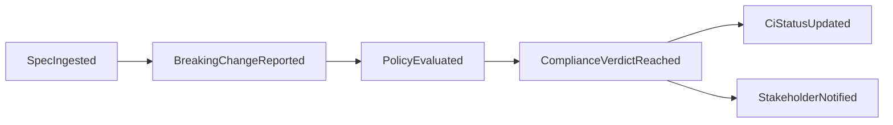

# ADR-003: Event-Driven Communication Between Bounded Contexts

**Status:** Accepted
**Date:** 2026-06-12
**Session:** 7bff170e-8b01-4621-9de1-4397f096b27a

## Context

The 7 bounded contexts need to communicate without tight coupling. Direct API calls between contexts create synchronous dependencies and prevent independent evolution. The system needs eventual consistency — CI should not wait for all downstream processing.

Additionally, the local/remote split means the CLI runs in a different process/network than the server. Communication between them is inherently asynchronous.

## Decision

Use **domain events** as the primary cross-context communication mechanism:

**1. Internal events (server-side):** In-process message bus with guaranteed delivery (at-least-once). Events flow through a defined event chain:



**2. External events (CLI → server):** HTTP upload of `LocalDiffResult` to Contract Ingestion endpoint. Fire-and-forget from CLI perspective; server owns retry and deduplication.

**3. Query interceptions (read-only):** Dashboard and Dependency Graph may query other contexts' data stores directly (read-replicas) — this is not event-driven but is acceptable for read-only access.

**Event Schema Requirements:**
- All events carry: `source` (context name), `timestamp` (ISO-8601), `idempotencyKey`
- Events are versioned (semantic version on schema)
- Breaking schema changes require a new event version; consumers must handle backward compatibility

## Alternatives Considered

| Alternative | Pros | Cons | Reason Rejected |
|-------------|------|------|-----------------|
| Synchronous RPC (gRPC) | Strong consistency, typed contracts | Tight coupling; cascading failures; violates <50ms CI target | Too synchronous for the event chain |
| Shared database | Simple reads | Tight coupling; no clear ownership boundaries | Violates DDD bounded context principles |
| External message broker (Kafka/RabbitMQ) | Durable, scalable, routing | Operational overhead; over-engineering for modular monolith | Premature; can adopt later when extracting microservices |

## Consequences

### Positive
- Loose coupling — contexts evolve independently
- Eventual consistency is acceptable for governance audits
- Event log doubles as audit trail
- Extraction to microservices is natural (swap in-process bus for Kafka)

### Negative
- Eventual consistency means dashboard may be slightly behind real-time
- Event schema versioning discipline required
- Debugging event chains is harder than synchronous calls

### Neutral
- Message bus choice (in-process → Redis Streams → Kafka) can evolve with scale

## Implementation

**Affected Modules:**
- All 6 server-side modules (each publishes/subscribes to events)

**Event Bus Selection (v1):**
- Use Spring `ApplicationEventPublisher` (in-process) for development
- Abstract behind `EventBus` interface so the implementation can be swapped for Redis Streams later

```java
public interface EventBus {
    void publish(DomainEvent<?> event);
    <T> void subscribe(String eventType, Consumer<DomainEvent<T>> handler);
}

// Default implementation: Spring ApplicationEventPublisher
@Component
public class SpringEventBus implements EventBus {
    @Autowired private ApplicationEventPublisher publisher;
    
    public void publish(DomainEvent<?> event) {
        publisher.publishEvent(event);
    }
}
```

## Validation

**Validators Required:**
- integration-validator: Verify event delivery guarantees (at-least-once, ordered per aggregate)
- architecture-validator: Verify no synchronous cross-context calls exist beyond read replicas

## References

- Related ADRs: ADR-004 (Event Sourcing), ADR-007 (Idempotency)
- `.pi/architecture/diagrams/domain-event-flow.md`
- `.pi/architecture/diagrams/system-overview.md`

---

*Decision date: 2026-06-12*
