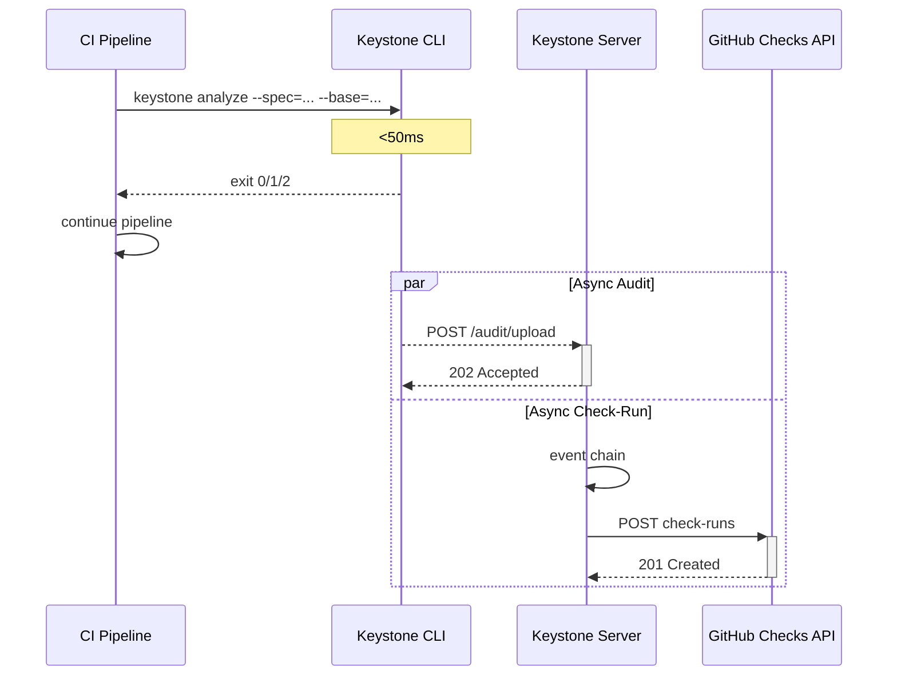

# ADR-008: CI Integration Pattern — Sync Local Verdict + Async Audit

**Status:** Accepted
**Date:** 2026-06-12
**Session:** 7bff170e-8b01-4621-9de1-4397f096b27a

## Context

The CI integration must provide fast feedback to developers while maintaining a complete audit trail. The domain exploration identified this as open question #5: "Should CI evaluation be synchronous (block the pipeline until verdict) or asynchronous?"

The answer was resolved as "synchronous local verdict + async server processing" but the exact integration pattern with GitHub/GitLab check-run APIs was not specified.

## Decision

**Three-phase CI integration:**

**Phase 1 — CLI invocation (synchronous, blocking, <50ms):**
```yaml
# .github/workflows/governance.yml
- name: Keystone Governance Check
  run: keystone analyze --spec=openapi.yaml --base=${{ github.event.before }}
  # Exits with: 0 (pass), 1 (fail), 2 (warn)
```
- CI step blocks on CLI exit
- CLI parses spec, diffs locally, produces verdict
- Time budget: <50ms for specs <1MB
- Output includes JSON summary for pipeline consumption

**Phase 2 — Audit upload (asynchronous, non-blocking, <1s):**
- CLI spawns a background thread after main process exits
- Uploads `LocalDiffResult` to Keystone server
- If upload fails: logged locally; retried on next CLI invocation
- Server deduplicates by idempotency key `(repo, commit_sha, spec_path)`

**Phase 3 — Server-side check-run (asynchronous, <3s total):**
- Spring Boot server processes full event chain (ingestion → analysis → policy)
- Posts detailed check-run to GitHub/GitLab via GitHub API client with `conclusion: success/failure/neutral`
- Developers see "Keystone Governance" check on PR with link to dashboard



**GitHub/GitLab check-run integration:**
- Keystone registers as a GitHub App or uses a personal access token
- Check-run name: `keystone/governance`
- States: `queued` → `in_progress` → `completed` (conclusion: `success`, `failure`, `neutral`)
- Target URL points to Keystone Dashboard for full report

## Alternatives Considered

| Alternative | Pros | Cons | Reason Rejected |
|-------------|------|------|-----------------|
| Pure synchronous (pipeline blocks for full analysis) | Single verdict source | Pipeline waits 1-5s for server; violates latency target | Blocks developers |
| Pure asynchronous (pipeline never blocks) | No pipeline slowdown | Developer pushes → waits minutes for result; poor feedback loop | Bad developer experience |
| Only CLI verdict (no server check-run) | Simple, fast | No persistent audit, no dashboard, no policy enforcement | Loses enterprise value |

## Consequences

### Positive
- Developers get near-instant feedback (<50ms added to pipeline)
- Detailed results available in GitHub/GitLab UI (check-run with link to dashboard)
- CI pipeline is not blocked by server-side processing
- Works in air-gapped environments (local-only mode)

### Negative
- CLI verdict may differ slightly from server verdict (cached vs full policy eval) — rare, documented
- Background upload process may be killed by CI runner cleanup (mitigation: retry on next invocation)
- Developers must check GitHub/GitLab UI for full details (not just CLI exit code)

### Neutral
- Requires GitHub App installation or PAT configuration by platform engineer
- Check-run appears ~2-3s after push (acceptable for async feedback)

## Implementation

**Affected Modules:**
- `.pi/architecture/modules/cli-orchestrator.md` (exit codes, async upload)
- `.pi/architecture/modules/notification-engine.md` (check-run API integration)

**CLI exit codes:**
| Code | Meaning | GitHub Check-Run Conclusion |
|------|---------|----------------------------|
| 0 | Pass — no breaking changes | `success` |
| 1 | Fail — breaking changes detected without exemptions | `failure` |
| 2 | Warn — non-breaking issues found (deprecations, warnings) | `neutral` |
| 3+ | Error — CLI could not analyze (parse error, missing spec) | `failure` with error details |

## Validation

**Validators Required:**
- integration-validator: Verify check-run appears correctly on GitHub for all verdict states
- operations-validator: Verify <50ms CLI phase under load; verify upload retry behavior
- ci-mr-validator: Verify the CI pipeline configuration is correct

## References

- Related ADRs: ADR-002 (CLI Orchestrator architecture), ADR-007 (Upload idempotency)
- `.pi/architecture/diagrams/sequence-ci-flow.md`
- `.pi/architecture/modules/cli-orchestrator.md`
- `.pi/architecture/modules/notification-engine.md`

---

*Decision date: 2026-06-12*
