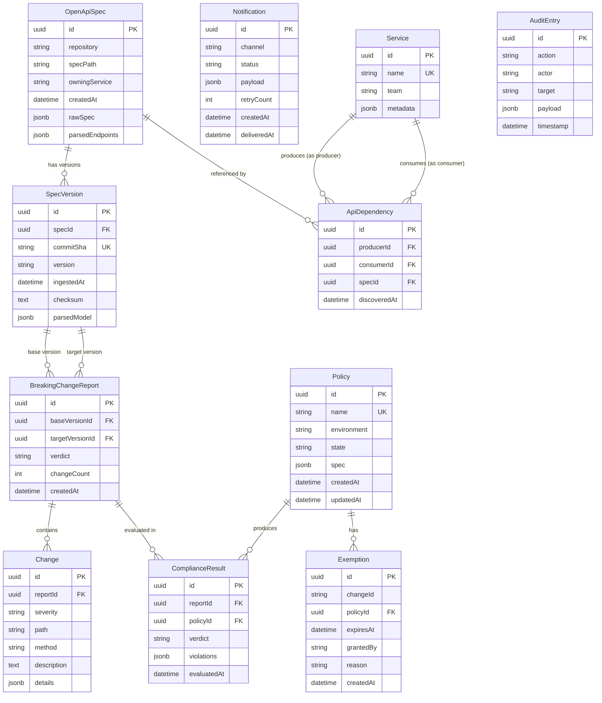

# Data Model — Entity Relationships

> Logical data model across all bounded contexts. Physical schema may differ (e.g., event store vs relational).



## Entity Type Summary

| Entity | Type | Context | Persistence |
|--------|------|---------|------------|
| OpenApiSpec | Aggregate Root | Contract Ingestion | PostgreSQL |
| SpecVersion | Value Object | Contract Ingestion | PostgreSQL (part of OpenApiSpec) |
| ParsedEndpoint | Value Object | Contract Ingestion | JSONB in SpecVersion |
| BreakingChangeReport | Aggregate Root | Breaking Change Analysis | PostgreSQL |
| Change | Entity | Breaking Change Analysis | PostgreSQL |
| ChangeSeverity | Value Object | Breaking Change Analysis | Enum in Change |
| Policy | Aggregate Root | Policy Engine | PostgreSQL |
| PolicyRule | Value Object | Policy Engine | JSONB in Policy |
| ComplianceResult | Value Object | Policy Engine | PostgreSQL |
| Exemption | Entity | Policy Engine | PostgreSQL |
| Notification | Aggregate Root | Notification Engine | PostgreSQL |
| CiStatusUpdate | Value Object | Notification Engine | JSONB in Notification |
| ApiDependency | Aggregate Root | Dependency Graph | PostgreSQL |
| Service | Entity | Dependency Graph | PostgreSQL |
| ImpactAnalysisResult | Value Object | Dependency Graph | JSONB (ephemeral) |
| GovernanceHealthScore | Value Object | Dashboard | Computed (no persistence) |
| AuditEntry | Entity | Dashboard | PostgreSQL (`audit` schema, append-only event store) |
| LocalAnalysisRequest | Value Object | CLI Orchestrator | Ephemeral (in-memory, in `keystone-cli` Go binary) |
| CachedSpec | Value Object | CLI Orchestrator | Local filesystem (in `keystone-cli` binary) |
| LocalDiffResult | Value Object | CLI Orchestrator | Ephemeral (stdout, in `keystone-cli` binary) |

## Physical Database Layout

All server-side bounded contexts share a **single PostgreSQL instance** with **logical schemas** for isolation:

```
PostgreSQL (keystone_db)
├── ingestion     → OpenApiSpec, SpecVersion
├── analysis      → BreakingChangeReport, Change
├── policy        → Policy, ComplianceResult, Exemption (cache only; source of truth = Git)
├── notifications → Notification
├── graph         → Service, ApiDependency
└── audit         → AuditEntry (event store)
```

**Rules:**
- Each Spring `@Service` only accesses its own schema via a dedicated `DataSource` bean
- Cross-schema queries are prohibited at the application layer (use domain events instead)
- The `audit` schema is append-only — INSERT only, no UPDATE/DELETE
- The `policy` schema is a cache — the Git repository is the source of truth

## Key Constraints & Indices

| Table | Index | Type | Purpose |
|-------|-------|------|---------|
| spec_versions | (spec_id, commit_sha) | UNIQUE | Idempotency key for dedup |
| policies | (name, environment) | UNIQUE | No duplicate policy names per env |
| services | name | UNIQUE | Single registration per service |
| api_dependencies | (producer_id, consumer_id, spec_id) | UNIQUE | No duplicate dependency edges |
| audit_entries | timestamp | BRIN | Time-range queries for dashboard |
| changes | report_id | B-tree | Fast lookup by report |
| exemptions | (policy_id, change_id) | UNIQUE | No duplicate exemptions for same change |
