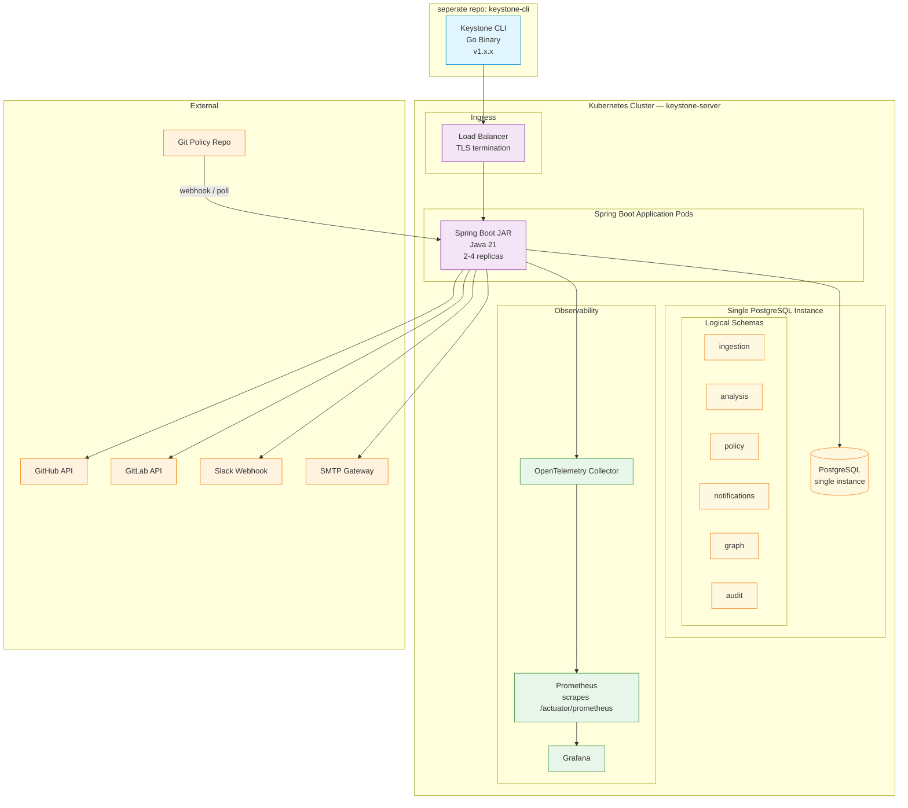

# Deployment Architecture

> Production deployment topology for Keystone Server (this repository).
> CLI Orchestrator is a separate Go binary — see `keystone-cli` repository.



---

## Resource Requirements

### Spring Boot Application Pods

| Resource | Request | Limit | Notes |
|----------|---------|-------|-------|
| CPU | 2 cores | 4 cores | Spring WebFlux handles async well with fewer threads |
| Memory | 4Gi | 8Gi | JVM heap + native memory; bounded contexts share heap |
| Replicas | 2 (min) | 6 (max) | HPA based on request rate + event queue depth |
| JVM Args | `-Xms2g -Xmx6g -XX:+UseZGC` | — | ZGC for low-pause GC under load |

### PostgreSQL

| Setting | Value | Notes |
|---------|-------|-------|
| Instance type | Single primary with read replica | Patroni for automatic failover |
| Storage | 100GB SSD (gp3) | Grows with event sourcing; plan for 500GB at 1yr |
| Connection pool | HikariCP (max 20 per schema) | 6 schemas × 20 = 120 max connections |
| Backups | Daily snapshot + WAL archiving | PITR to 7 days |

---

## Network Architecture

| Traffic | Protocol | Port | TLS |
|---------|----------|------|-----|
| CLI → Spring Boot | HTTPS | 443 | TLS 1.3 |
| Webhook (GitHub/GitLab) → Spring Boot | HTTPS | 443 | TLS 1.3 (webhook secret verification) |
| Spring Boot → PostgreSQL | TCP | 5432 | mTLS (cert-based auth) |
| Spring Boot → GitHub/GitLab API | HTTPS | 443 | TLS 1.3 |
| Spring Boot → Git Policy Repo | HTTPS | 443 | SSH deploy key |

---

## Guardian CI Pipeline (keystone-server)

```
┌─────────────┐     ┌────────────────┐     ┌────────────────┐     ┌──────────────┐
│  PR Check   │────→│  Unit Tests    │────→│  Guardian      │────→│  Integration │
│  (mvn compile,│     │  (JUnit 5,     │     │  Validators    │     │  Tests        │
│   checkstyle)│     │   90%+)        │     │  (package rings,│     │  (SpringBootTest)│
└─────────────┘     └────────────────┘     │  @Transactional,│     └──────┬───────┘
                                            │  @PreAuthorize,│            │
                                            │  canonical refs)│            │
                                            └────────────────┘            │
                                                                          ▼
                                   ┌────────────────┐     ┌──────────────────────┐
                                   │  Docker Build  │     │  Tag Release (semver) │
                                   │  (paketo       │     │  + Deploy to staging  │
                                   │   buildpacks)  │     │                       │
                                   └────────────────┘     └──────────────────────┘
```

---

## Chaos Engineering / Resilience

| Fault | Mitigation |
|-------|-----------|
| PostgreSQL primary failure | Patroni automatic failover to replica |
| Spring Boot pod crash | Liveness probe (`/actuator/health/liveness`) + CrashLoopBackoff |
| GitHub API rate limit | Resilience4j circuit breaker + rate limiter |
| Policy Git repo unavailable | Policy Engine uses last synced cache; retries on next poll cycle |
| Event bus backlog | In-process event bus is bounded (LinkedBlockingQueue); backpressure via rejection |

---

*Last updated: 2026-06-12*
