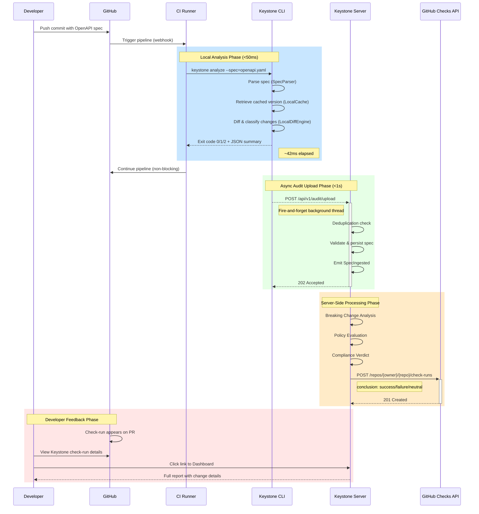

# CI Pipeline — End-to-End Sequence

> Shows the full flow from push to PR check-run across the local CLI and server-side processing.

## Phase Timings

| Phase | Target Latency | Blocking? | Failure Impact |
|-------|---------------|-----------|---------------|
| **Local Analysis** | <50ms | Yes — CI blocks on CLI exit | CI step fails; pipeline may block |
| **Async Upload** | <1s | No — background thread | Upload fails → missing audit record; CI unaffected |
| **Server Processing** | <2s | No — async | Delayed check-run on PR; no CI impact |
| **Check-Run Visible** | <3s (total from push) | No — async | Developer must wait for check-run |

## Degraded Modes

| Scenario | Behavior |
|----------|----------|
| **Air-gapped (no network)** | CLI runs in local-only mode; no upload attempted; verdict based on cached spec only |
| **Server unavailable** | CLI exits with verdict; upload queued locally (retry on next invocation) |
| **No cached version** | CLI diffs against empty baseline → all changes classified as additive (safe default) |
| **Spec exceeds 1MB** | CLI falls back to streaming diff; latency may exceed 50ms; warning emitted |
