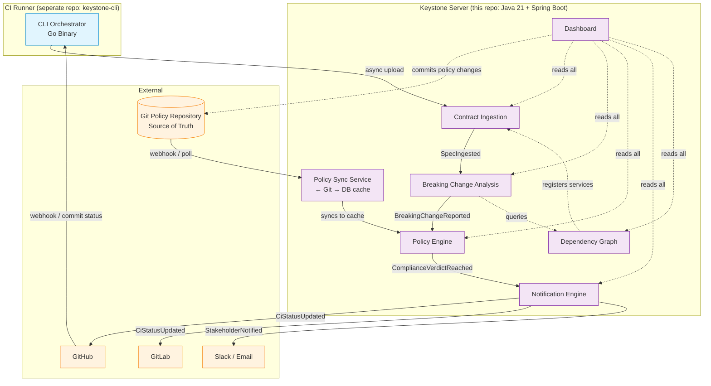

# System Context Diagram

## Context

We are building **Keystone**, an enterprise API contract governance platform.
Detects breaking changes in OpenAPI specs before production.

## Repository Split

- **keystone-server** (this repo): Java 21 + Spring Boot — all server-side bounded contexts
- **keystone-cli** (separate repo): Go binary — local CI runner analysis

## Bounded Contexts Flow



## Event Flow (Server-Side)

```
CLI HTTP upload → Contract Ingestion
    → SpecIngested event (Spring ApplicationEventPublisher)
    → Breaking Change Analysis
    → BreakingChangeReported event
    → Policy Engine (reads from DB cache; source of truth is Git)
    → ComplianceVerdictReached event
    → Notification Engine
    → CiStatusUpdated (GitHub/GitLab) + StakeholderNotified (Slack/Email)
```

## Key Architectural Decisions

- **Java 21 + Spring Boot** for full Guardian validator support (package rings, @Transactional, @PreAuthorize)
- **CLI is a separate Go project** — keeps binary lean, no JVM dependency in CI runner
- **Policy source of truth = Git repository** — database is a read-through cache synced by PolicySyncService
- **In-process event bus** (Spring `ApplicationEventPublisher`) for v1 modular monolith
- **Single PostgreSQL instance** with logical schemas per bounded context
- **Dependency Graph** uses explicit `keystone.yml` declarations in v1 (no automated discovery)

---

*Generated from session: 7bff170e-8b01-4621-9de1-4397f096b27a*
*Date: 2026-06-12*
*Updated: 2026-06-12 — Java/Spring stack, separate CLI repo, Git policy source, single PostgreSQL*
