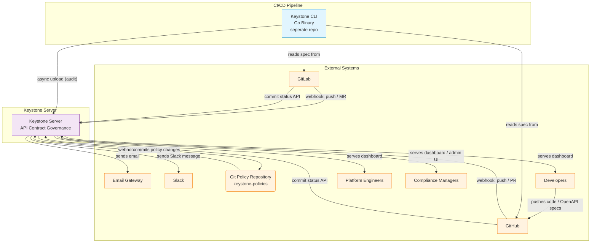

# System Architecture Overview

> **C4 Model — Level 1: System Context & Level 2: Container**
> Keystone-specific architecture reference. All module docs and implementation files reference this document.

---

## Repository Structure

This architecture spans **two repositories**:

| Repository | Language | Stack | Purpose |
|-----------|----------|-------|---------|
| `keystone-server` | Java 21 | Spring Boot 3.x, Spring Modulith, PostgreSQL | Server-side bounded contexts (this repo) |
| `keystone-cli` | Go | Embedded diff engine, HTTP client | Local CI runner analysis (separate repo) |

---

## 1. System Context (C4 Level 1)



**Actors:**
| Actor | Interacts With | Through |
|-------|---------------|---------|
| Developer (API Owner) | GitHub/GitLab, CLI, Dashboard | Push code, run CI, view results |
| Platform Engineer | GitHub/GitLab, Dashboard, CLI | Configure CI, manage integration |
| Compliance Manager | Dashboard, Git Policy Repository | Define policies (DSL), manage exemptions, audit |

---

## 2. Container Diagram (C4 Level 2)

```mermaid
graph TB
    subgraph "seperate repo: keystone-cli"
        CLI_BIN[Keystone CLI<br/>Go Binary]
        CACHE[(Local Cache<br/>Filesystem)]
    end

    subgraph "this repo: keystone-server (Java 21 + Spring Boot)"

        subgraph "HTTP Layer"
            HTTP_SERVER[Spring Boot HTTP Server<br/>WebFlux<br/>
            Acts as entry point / router]
        end

        subgraph "Bounded Contexts (Spring Modulith packages)"
            CI[Contract Ingestion<br/>Spring @Service]
            BCA[Breaking Change Analysis<br/>Spring @Service]
            PE[Policy Engine<br/>Spring @Service]
            PS[>> Policy Sync Service <<br/>Polls Git, syncs to cache]
            NE[Notification Engine<br/>Spring @Service]
            DG[Dependency Graph<br/>Spring @Service]
            DB[Dashboard<br/>Spring @Service]
        end

        subgraph "Data Stores"
            PG_DB[(PostgreSQL<br/>single instance<br/>logical schemas:
            ingestion | analysis | policy |
            notifications | graph | audit)]
            GIT_REPO[Git Policy Repository<br/>Source of Truth for policies]
        end

        subgraph "Infrastructure"
            EB[In-process Event Bus<br/>Spring ApplicationEventPublisher<br/>→ Future: Redis Streams]
            METRICS[Prometheus Metrics<br/>/actuator/prometheus]
        end
    end

    subgraph "External Systems"
        GIT_GQL[GitHub / GitLab API]
        EMAIL_SVC[Email Service]
        SLACK_SVC[Slack Webhook]
    end

    %% CLI interactions
    CLI_BIN --> CACHE
    CLI_BIN -- "HTTP POST /api/v1/audit" --> HTTP_SERVER

    %% HTTP routing
    HTTP_SERVER --> CI
    HTTP_SERVER --> DB

    %% Event chain via Spring EventPublisher
    CI -- "SpecIngested" --> EB
    EB --> BCA
    BCA -- "BreakingChangeReported" --> EB
    EB --> PE
    PE -- "ComplianceVerdictReached" --> EB
    EB --> NE

    %% Policy source of truth: Git → PolicySyncService → DB cache
    GIT_REPO -- "webhook / poll (60s)" --> PS
    PS --> PE
    PS --> PG_DB

    %% Policy UI writes to Git (not directly to DB)
    DB -. "commits policy changes" .-> GIT_REPO

    %% Data stores
    CI --> PG_DB
    BCA --> PG_DB
    PE --> PG_DB
    NE --> PG_DB
    DG --> PG_DB

    %% Cross-cutting queries (read-only)
    BCA -. "queries dep graph" .-> DG
    DG -. "queries specs" .-> CI
    DB -. "reads all (read replicas)" .-> PG_DB

    %% External notifications
    NE --> GIT_GQL
    NE --> EMAIL_SVC
    NE --> SLACK_SVC

    classDef local fill:#e1f5fe,stroke:#0288d1
    classDef app fill:#f3e5f5,stroke:#7b1fa2
    classDef service fill:#e8f5e9,stroke:#388e3c
    classDef store fill:#fff8e1,stroke:#f57f17
    classDef infra fill:#fce4ec,stroke:#c62828
    classDef ext fill:#fff3e0,stroke:#f57c00
    class CLI_BIN,CACHE local
    class HTTP_SERVER app
    class CI,BCA,PE,PS,NE,DG,DB service
    class PG_DB,GIT_REPO store
    class EB,METRICS infra
    class GIT_GQL,EMAIL_SVC,SLACK_SVC ext
```

**Key Architectural Notes:**
- **CLI is a separate Go project** in its own repository (`keystone-cli`). This document only covers `keystone-server`.
- **Policy source of truth is the Git repository**, not the database. The database is a read-through cache synced by PolicySyncService. All policy writes go through Git (either direct commits by compliance managers or via Dashboard UI that commits to Git).
- **All bounded contexts share a single PostgreSQL instance** with logical schemas for isolation. This avoids operational overhead of multiple database clusters in v1. Each context only accesses its own schema.
- **Event bus is in-process** (Spring `ApplicationEventPublisher`) for v1. This provides zero-latency event delivery within the same JVM. Future extraction to microservices would replace this with Redis Streams or Kafka.
- **HTTP Server is the Spring Boot entry point** — not a separate API Gateway service. It routes requests to bounded contexts based on URL path.

---

## 3. Module Dependency Map

| Module | Project | Owns Data Store? | Publishes Events | Subscribes To | Guardian Validators |
|--------|---------|-----------------|-----------------|---------------|-------------------|
| **CLI Orchestrator** | `keystone-cli` (separate) | Local filesystem cache | HTTP upload (no events) | — | golangci-lint, go test |
| **Contract Ingestion** | `keystone-server` | `ingestion` schema | `SpecIngested`, `SpecParseFailed` | — | @Transactional, package rings |
| **Breaking Change Analysis** | `keystone-server` | `analysis` schema | `BreakingChangeReported` | `SpecIngested` | Package rings, canonical refs |
| **Policy Engine** | `keystone-server` | `policy` schema (cache) + Git repo (source) | `PolicyEvaluated`, `ComplianceVerdictReached`, `ExemptionGranted` | `BreakingChangeReported` | @PreAuthorize, package rings |
| **Policy Sync Service** | `keystone-server` | — (writes to policy cache) | — | Git webhook / poll timer | — |
| **Notification Engine** | `keystone-server` | `notifications` schema | `CiStatusUpdated`, `StakeholderNotified` | `ComplianceVerdictReached`, `ExemptionGranted` | @Transactional, circuit breaker |
| **Dependency Graph** | `keystone-server` | `graph` schema | `DependencyAdded`, `DownstreamImpactComputed` | `SpecIngested` | Package rings |
| **Dashboard** | `keystone-server` | *(read-only replicas)* | — | — | @PreAuthorize, layer compliance |

---

## 4. Data Flow by Scenario

### 4.1 CI Pipeline — Happy Path

```
1. Developer pushes commit with spec change to GitHub
2. GitHub triggers CI pipeline
3. CI step: keystone analyze --spec=openapi.yaml  (Go CLI, separate repo)
4. CLI reads spec, diffs vs cached version → LocalDiffResult (~42ms)
5. CLI exits with code 0 (pass) or 1 (fail)
6. [Async] CLI uploads result to Spring Boot HTTP Server (POST /api/v1/audit)
7. Contract Ingestion validates, deduplicates, persists
8. Spring ApplicationEventPublisher emits SpecIngested
9. Event chain: BreakingChangeAnalysis → PolicyEngine → NotificationEngine
10. NotificationEngine posts check-run to GitHub Checks API
```

### 4.2 Policy Update Flow

```
1. Compliance Manager edits keystone-policy.yaml via Dashboard UI
2. Dashboard commits changes to Git Policy Repository (via GitHub API)
3. Git webhook → PolicySyncService (or poll every 60s)
4. PolicySyncService validates YAML, updates policy cache in PostgreSQL
5. PolicyEngine picks up new policy on next evaluation
```

### 4.3 Exemption Workflow

```
1. Compliance Manager opens Dashboard
2. Views a failing policy evaluation
3. Grants exemption (time-bound) via Dashboard UI
4. Dashboard commits exemption to keystone-policy.yaml in Git repo
5. PolicySyncService picks up the change → updates cache
6. PolicyEngine re-evaluates the affected report; emits ExemptionGranted
7. NotificationEngine posts updated status to GitHub
```

---

## 5. Guardian Framework Validation

| Validator | Enforced On | What It Checks |
|-----------|------------|---------------|
| Package rings | All server modules | No circular dependencies between bounded contexts |
| @Transactional | All database operations | Transactional boundaries on every repository method |
| @PreAuthorize | All API endpoints + service methods | RBAC enforcement (hasRole('COMPLIANCE_MANAGER'), etc.) |
| Canonical references | All source files | Source code annotations match architecture doc section IDs |
| Layer compliance | All packages | Domain layer never imports infrastructure layer |
| CI validators | Build pipeline | Tests pass, lint passes, build succeeds |
| Security validator | All endpoints | Injection, auth bypass, secret leakage |

## 6. Service Level Objectives (SLOs)

| Metric | Target | Measured By |
|--------|--------|-------------|
| CLI analysis latency (spec <1MB) | <50ms p99 | CLI self-report |
| Server-side event chain (ingestion → notification) | <2s p95 | Micrometer tracing |
| Dashboard page load | <500ms | Micrometer HTTP metrics |
| Audit log query (30 days) | <2s | Database query profiling |
| Dependency graph propagation | <30s from spec ingestion | Event timing |
| Uptime | 99.9% | /actuator/health |

---

*Last updated: 2026-06-12*
*Architecture version: v1.0.0*
