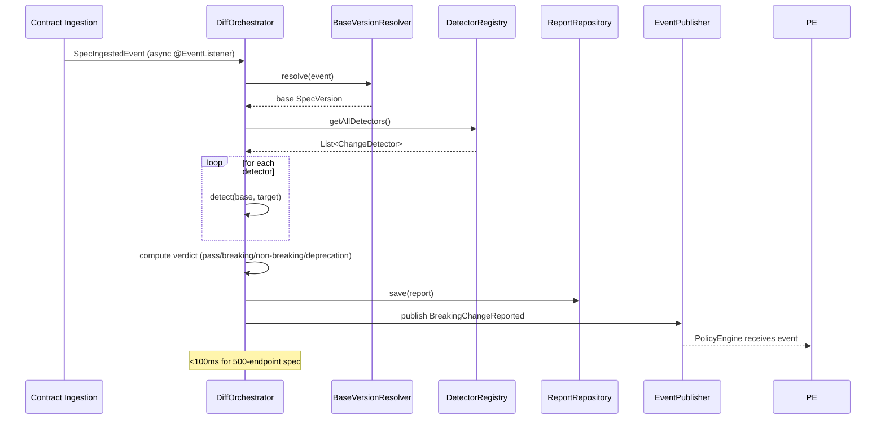

# Breaking Change Analysis Architecture

> **Module location:** `keystone-server` (this repository)
> **Language:** Java 21 + Spring Boot
> **Package:** `com.keystone.analysis`
> **Guardian validators:** package rings, canonical references

## Overview

Diffs two versions of an OpenAPI spec, classifies each change by severity (breaking/non-breaking/additive/deprecation), and produces a `BreakingChangeReport`. Uses a strategy-pattern-based change detector architecture. Subscribes to `SpecIngested` events via Spring `@EventListener`.

## Responsibilities

- Subscribe to `SpecIngested` events from Contract Ingestion
- Retrieve base and target `SpecVersion` for diffing
- Run registered change detectors against the diff
- Classify each change with a `ChangeSeverity`
- Produce a `BreakingChangeReport` aggregate
- Publish `BreakingChangeReported` domain event
- Expose report retrieval for Dashboard and Policy Engine

## Components {#components}

| Component | Java Class | Purpose | Canonical Section |
|-----------|-----------|---------|-------------------|
| DiffOrchestrator | `DiffOrchestrator.java` | Coordinates the diff process | #diff-orchestrator |
| ChangeDetector | `ChangeDetector.java` | Strategy interface for change detectors | #change-detector |
| DetectorRegistry | `DetectorRegistry.java` | Load and register change detector implementations | #detector-registry |
| BaseVersionResolver | `BaseVersionResolver.java` | Resolves base spec via 3-layer fallback | #base-version-resolver |
| ChangeReportRepository | `ChangeReportRepository.java` | JPA repository for BreakingChangeReport | #change-report-repository |

---

## Component Details {#component-details}

### ChangeDetector Strategy Interface {#change-detector}

**Purpose:** Strategy pattern for detecting specific types of breaking/non-breaking changes.

**Implementation File:** `src/main/java/com/keystone/analysis/detector/ChangeDetector.java`

**Interface:**

```java
public interface ChangeDetector {
    String getName();
    List<Change> detect(ParsedEndpoint base, ParsedEndpoint target);
    ChangeSeverity getSeverity();
}
```

### Built-in Detectors {#built-in-detectors}

```java
@Component
public class PathRemovalDetector implements ChangeDetector {
    @Override public String getName() { return "PathRemoval"; }
    @Override public ChangeSeverity getSeverity() { return ChangeSeverity.BREAKING; }
    @Override
    public List<Change> detect(ParsedEndpoint base, ParsedEndpoint target) {
        // If endpoint exists in base but not in target → BREAKING
    }
}

@Component
public class RequiredFieldAddedDetector implements ChangeDetector { /* ... */ }

@Component
public class FieldRemovalDetector implements ChangeDetector { /* ... */ }

@Component
public class FieldTypeChangedDetector implements ChangeDetector { /* ... */ }

@Component
public class OptionalFieldAddedDetector implements ChangeDetector { /* ... */ }

@Component
public class DeprecatedFieldDetector implements ChangeDetector { /* ... */ }
```

### DiffOrchestrator {#diff-orchestrator}

**Purpose:** Coordinates the full diff pipeline.

**Implementation File:** `src/main/java/com/keystone/analysis/orchestrator/DiffOrchestrator.java`

**Interface:**

```java
@Service
public class DiffOrchestrator {

    @Autowired private DetectorRegistry detectorRegistry;
    @Autowired private BaseVersionResolver baseVersionResolver;
    @Autowired private ChangeReportRepository reportRepository;
    @Autowired private ApplicationEventPublisher eventPublisher;

    @EventListener
    public BreakingChangeReport onSpecIngested(SpecIngestedEvent event) {
        // 1. Resolve base version (3-layer fallback)
        SpecVersion base = baseVersionResolver.resolve(event);
        // 2. Load target version
        SpecVersion target = specVersionRepository.findById(event.specVersionId());
        // 3. Run all detectors
        List<Change> changes = detectorRegistry.getAllDetectors().stream()
            .flatMap(detector -> detector.detect(base, target).stream())
            .toList();
        // 4. Compute verdict
        Verdict verdict = changes.isEmpty() ? Verdict.PASS :
            changes.stream().anyMatch(c -> c.severity() == ChangeSeverity.BREAKING)
                ? Verdict.BREAKING : Verdict.NON_BREAKING;
        // 5. Persist report
        BreakingChangeReport report = new BreakingChangeReport(base.id(), target.id(), verdict, changes);
        reportRepository.save(report);
        // 6. Publish event
        eventPublisher.publishEvent(new BreakingChangeReportedEvent(report.id(), verdict, changes));
        return report;
    }
}
```

### BaseVersionResolver {#base-version-resolver}

**Purpose:** Three-layer fallback for resolving the base spec version to diff against.

**Implementation File:** `src/main/java/com/keystone/analysis/resolver/BaseVersionResolver.java`

**Interface:**

```java
@Service
public class BaseVersionResolver {

    @Autowired private SpecVersionRepository specVersionRepository;

    public SpecVersion resolve(SpecIngestedEvent event) {
        // Layer 1: Explicit base ref from CI (event.explicitBaseRef())
        if (event.explicitBaseRef() != null) {
            return specVersionRepository.findByCommitSha(event.explicitBaseRef())
                .orElse(null);
        }
        // Layer 2: Previous ingested version of same spec
        SpecVersion previous = specVersionRepository
            .findPreviousVersion(event.specId());
        if (previous != null) return previous;
        // Layer 3: Latest version on main branch
        return specVersionRepository.findLatestOnBranch(event.repository(), "main")
            .orElseThrow(() -> new NoBaseVersionException("No base version found"));
    }
}
```

---

## Data Flow {#data-flow}



---

## Dependencies {#dependencies}

### Depends On
- **Contract Ingestion**: SpecVersion retrieval for base/target specs (via `SpecVersionRepository`)

### Used By
- **Policy Engine**: Subscribes to `BreakingChangeReported` via `@EventListener`
- **Dependency Graph**: Queries report data for impact analysis
- **Dashboard**: Reads report history

---

## Security Considerations {#security}

| Concern | Mitigation | Validator |
|---------|------------|-----------|
| Unauthorized report access | `@PreAuthorize("hasRole('VIEWER')")` on report retrieval | security-validator |
| Event tampering | Events are in-process (same JVM), no network exposure | security-validator |

---

## Testing Requirements {#testing}

| Test Type | Coverage Target | Approach |
|-----------|-----------------|----------|
| Unit | 85% | JUnit 5 + Mockito for each ChangeDetector |
| Integration | 75% | @SpringBootTest with embedded spec fixtures |
| Performance | — | JMH benchmark: 500-endpoint spec diff <100ms |

**Key Test Scenarios:**
- Breaking change: endpoint removed → `ChangeSeverity.BREAKING`
- Additive change: new optional field → `ChangeSeverity.ADDITIVE`
- Deprecation: field marked deprecated → `ChangeSeverity.DEPRECATION`
- No change: identical specs → empty change list, `Verdict.PASS`
- Base version missing: three-layer fallback exhausts → `NoBaseVersionException`

---

## Error Handling {#error-handling}

```java
public class NoBaseVersionException extends RuntimeException {
    public NoBaseVersionException(String message) {
        super(message);
    }
}

public class DiffAnalysisException extends RuntimeException {
    public DiffAnalysisException(String message, Throwable cause) {
        super(message, cause);
    }
}
```

**Error Recovery:**
- NoBaseVersionException: report with `Verdict.INCONCLUSIVE`, all changes treated as additive (safe default)
- Detector failure: individual detector is skipped, error logged, remaining detectors continue

---

## Performance Considerations {#performance}

| Metric | Target | Monitoring |
|--------|--------|------------|
| Diff for 500-endpoint spec | <100ms p99 | Micrometer `analysis.diff.time` timer |
| Report generation throughput | 50 req/s | Micrometer `analysis.report.count` counter |
| Memory per diff | <50MB heap | Micrometer JVM metrics |

---

*Last updated: 2026-06-12*
*Module version: v0.1.0*
*Canonical anchors: #components, #component-details, #change-detector, #built-in-detectors, #diff-orchestrator, #base-version-resolver, #data-flow, #dependencies, #security, #testing, #error-handling, #performance*
