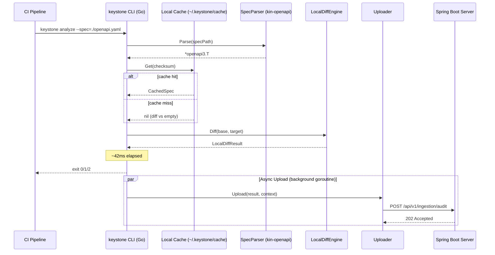

# CLI Orchestrator Architecture

> **⚠ This module lives in a separate repository: `keystone-cli`**
> **Language:** Go
> **Guardian validators:** golangci-lint, go test, 7 generic validators
> This document describes the interface contract between `keystone-cli` and `keystone-server`.

## Overview

Lightweight Go binary that runs inside the CI runner. Parses the current OpenAPI spec using `kin-openapi`, diffs against a locally cached previous version, produces a preliminary verdict within 50ms, and uploads results to the Spring Boot server for audit persistence.

## Responsibilities

- Receive spec change from CI pipeline (file path or git diff)
- Parse and validate the current OpenAPI 3.x spec via `kin-openapi/openapi3`
- Retrieve locally cached previous spec version (by SHA256 checksum)
- Perform a fast embedded diff and classify changes
- Produce a `LocalDiffResult` with preliminary verdict
- Upload results to Keystone server via HTTP POST (async, fire-and-forget)
- Exit with appropriate code (0 = pass, 1 = fail, 2 = warn)

## Components {#components}

| Component | Go File | Purpose | Canonical Section |
|-----------|---------|---------|-------------------|
| SpecParser | `cli/parser.go` | Parse and validate OpenAPI 3.x YAML/JSON via kin-openapi | #spec-parser |
| LocalCache | `cli/cache.go` | Read/write cached spec versions in `~/.keystone/cache/` | #local-cache |
| LocalDiffEngine | `cli/diff.go` | Fast embedded diff between two parsed specs | #local-diff-engine |
| Uploader | `cli/uploader.go` | Async HTTP upload of results to Spring Boot server | #uploader |
| CliMain | `cmd/keystone/main.go` | Entry point: flag parsing, orchestration | #cli-main |

---

## Component Details {#component-details}

### SpecParser {#spec-parser}

**Purpose:** Parse and validate an OpenAPI 3.x specification using `kin-openapi`.

**Implementation File:** `cli/parser.go`

**Dependencies:**
- `github.com/getkin/kin-openapi/openapi3`
- `github.com/getkin/kin-openapi/openapi3filter`

**Interface:**

```go
package cli

import (
    "github.com/getkin/kin-openapi/openapi3"
)

type Parser struct{}

func (p *Parser) Parse(path string) (*openapi3.T, error) {
    loader := openapi3.NewLoader()
    loader.IsExternalRefsAllowed = false
    doc, err := loader.LoadFromFile(path)
    if err != nil {
        return nil, fmt.Errorf("spec parse failed: %w", err)
    }
    if err := doc.Validate(loader.Context()); err != nil {
        return nil, fmt.Errorf("spec validation failed: %w", err)
    }
    return doc, nil
}

func (p *Parser) ParseFromBytes(data []byte) (*openapi3.T, error) {
    loader := openapi3.NewLoader()
    doc, err := loader.LoadFromData(data)
    if err != nil {
        return nil, fmt.Errorf("spec parse failed: %w", err)
    }
    return doc, nil
}
```

### LocalCache {#local-cache}

**Purpose:** Cache parsed spec versions locally so subsequent CI runs can diff without a network call.

**Implementation File:** `cli/cache.go`

**Dependencies:**
- Local filesystem (`~/.keystone/cache/` directory)
- `crypto/sha256` for checksum

**Interface:**

```go
package cli

import (
    "crypto/sha256"
    "encoding/hex"
    "os"
    "path/filepath"
)

type Cache struct {
    CacheDir string
}

func (c *Cache) Get(key string) (*CachedSpec, error) {
    path := filepath.Join(c.CacheDir, key+".json")
    data, err := os.ReadFile(path)
    if err != nil {
        return nil, fmt.Errorf("cache miss: %w", err)
    }
    var spec CachedSpec
    if err := json.Unmarshal(data, &spec); err != nil {
        return nil, fmt.Errorf("cache corrupt: %w", err)
    }
    return &spec, nil
}

func (c *Cache) Set(key string, spec *CachedSpec) error {
    data, err := json.Marshal(spec)
    if err != nil {
        return err
    }
    path := filepath.Join(c.CacheDir, key+".json")
    return os.WriteFile(path, data, 0644)
}

func Checksum(data []byte) string {
    h := sha256.Sum256(data)
    return hex.EncodeToString(h[:])
}

type CachedSpec struct {
    Checksum  string           `json:"checksum"`
    Endpoints []ParsedEndpoint `json:"endpoints"`
    CachedAt  time.Time        `json:"cachedAt"`
}
```

### LocalDiffEngine {#local-diff-engine}

**Purpose:** Fast embedded diff engine comparing two parsed OpenAPI specs.

**Implementation File:** `cli/diff.go`

**Interface:**

```go
package cli

func Diff(base, target *openapi3.T) *LocalDiffResult {
    changes := []Change{}

    // Compare paths
    for path, basePath := range base.Paths {
        targetPath, exists := target.Paths[path]
        if !exists {
            changes = append(changes, Change{
                Severity:   BREAKING,
                Path:       path,
                Method:     "",
                Description: fmt.Sprintf("Path '%s' removed", path),
            })
            continue
        }
        // Compare operations per path
        for method, baseOp := range basePath.Operations() {
            targetOp, exists := targetPath.GetOperation(method)
            if !exists {
                changes = append(changes, Change{
                    Severity:   BREAKING,
                    Path:       path,
                    Method:     string(method),
                    Description: fmt.Sprintf("Operation %s %s removed", method, path),
                })
                continue
            }
            // Compare request/response schemas
            changes = append(changes, compareSchemas(baseOp, targetOp, path, method)...)
        }
    }

    // Detect new paths (additive)
    for path := range target.Paths {
        if _, exists := base.Paths[path]; !exists {
            changes = append(changes, Change{
                Severity:   ADDITIVE,
                Path:       path,
                Description: fmt.Sprintf("Path '%s' added", path),
            })
        }
    }

    verdict := PASS
    for _, c := range changes {
        if c.Severity == BREAKING {
            verdict = BREAKING
            break
        }
    }

    return &LocalDiffResult{
        Verdict:   verdict,
        Changes:   changes,
        AnalysisMs: 42, // computed from actual timing
    }
}
```

### Uploader {#uploader}

**Purpose:** Asynchronously upload the LocalDiffResult to the Spring Boot server for audit persistence.

**Implementation File:** `cli/uploader.go`

**Dependencies:**
- `net/http` with retry

**Interface:**

```go
package cli

import (
    "bytes"
    "encoding/json"
    "net/http"
    "time"
)

type Uploader struct {
    ServerURL string
    APIToken  string
    Client    *http.Client
}

func (u *Uploader) Upload(result *LocalDiffResult, ctx *AnalysisContext) error {
    payload := AuditUploadPayload{
        Result:  result,
        Context: ctx,
    }
    data, _ := json.Marshal(payload)

    req, _ := http.NewRequest("POST",
        u.ServerURL+"/api/v1/ingestion/audit",
        bytes.NewReader(data))
    req.Header.Set("Content-Type", "application/json")
    req.Header.Set("Authorization", "Bearer "+u.APIToken)

    // Retry up to 3 times with exponential backoff
    for attempt := 0; attempt < 3; attempt++ {
        resp, err := u.Client.Do(req)
        if err == nil && resp.StatusCode < 500 {
            resp.Body.Close()
            return nil
        }
        time.Sleep(time.Duration(1<<attempt) * time.Second)
    }
    return fmt.Errorf("upload failed after 3 retries")
}
```

---

## Data Flow {#data-flow}



---

## Dependencies {#dependencies}

### Depends On
- *(none — CLI is self-contained; embeds kin-openapi and diff engine)*

### Used By
- **CI Pipeline**: Invokes CLI as a build step
- **Spring Boot Server**: Receives async audit uploads from Uploader

---

## Security Considerations {#security}

| Concern | Mitigation | Validator |
|---------|------------|-----------|
| Spec file tampering | CLI validates spec via `kin-openapi` schema validation | security-validator |
| Cache data integrity | Cache entries checksummed (SHA256); corrupted entries discarded | security-validator |
| Upload credentials | API token from `KEYSTONE_API_TOKEN` env var, never logged | security-validator |

**Authentication/Authorization:**
- API token for server upload (optional, scoped to `audit:write`)
- No auth needed for local-only mode (air-gapped)

**Data Protection:**
- No spec data persisted beyond local cache
- Upload uses TLS 1.3

---

## Testing Requirements {#testing}

| Test Type | Coverage Target | Approach |
|-----------|-----------------|----------|
| Unit | 85% | `go test` with table-driven tests for diff engine |
| Integration | 75% | `go test` with kin-openapi fixtures + httptest server |
| E2E | 60% | Full CLI invocation with real spec files |

**Key Test Scenarios:**
- Parse: valid and invalid OpenAPI 3.x specs
- Diff: breaking change correctly identified; additive change correctly identified
- Cache: hit recovers CachedSpec; miss falls back to empty baseline
- Upload: success returns nil; network failure retries 3 times then returns error
- Exit codes: 0 for pass, 1 for breaking, 2 for warn only

---

## Error Handling {#error-handling}

```go
type SpecParseError struct {
    Details []error
}

func (e *SpecParseError) Error() string {
    return fmt.Sprintf("spec parse failed: %v", e.Details)
}

type CacheMissError struct{}

func (e *CacheMissError) Error() string {
    return "cache miss (not an error — diffing against empty baseline)"
}

type UploadFailedError struct {
    Attempts int
    LastErr  error
}

func (e *UploadFailedError) Error() string {
    return fmt.Sprintf("upload failed after %d attempts: %v", e.Attempts, e.LastErr)
}
```

**Error Recovery:**
- SpecParseError: fail CI with exit code 3, detailed error to stderr
- CacheMissError: diff against empty baseline (all changes are additive) — warn only
- UploadFailedError: log warning to stderr, exit normally (audit upload is best-effort)

---

## Performance Considerations {#performance}

| Metric | Target | Monitoring |
|--------|--------|------------|
| Latency (spec <1MB) | <50ms p99 | CLI self-reports `analysisTimeMs` in JSON output |
| Cache hit rate | >90% | Upload payload includes cache hit/miss flag |
| Binary size | <10MB | Tracked in Go CI pipeline |
| Memory usage | <20MB RSS | `runtime.ReadMemStats` |

---

*Last updated: 2026-06-12*
*Module version: v0.1.0*
*Canonical anchors: #components, #component-details, #spec-parser, #local-cache, #local-diff-engine, #uploader, #cli-main, #data-flow, #dependencies, #security, #testing, #error-handling, #performance*
