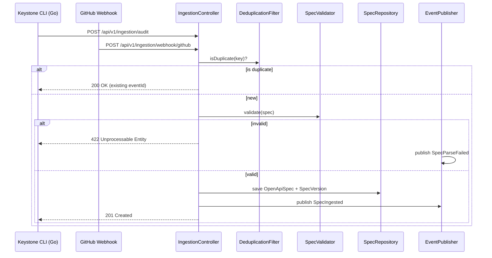

# Contract Ingestion Architecture

> **Module location:** `keystone-server` (this repository)
> **Language:** Java 21 + Spring Boot
> **Package:** `com.keystone.ingestion`
> **Guardian validators:** @Transactional, package rings

## Overview

Responsible for receiving, parsing, validating, and storing OpenAPI specifications. Handles async uploads from the CLI Orchestrator and webhook events from GitHub/GitLab. Publishes `SpecIngested` domain events via Spring `ApplicationEventPublisher` for the Breaking Change Analysis context.

## Responsibilities

- Receive spec data from CLI Orchestrator uploads and GitHub/GitLab webhooks
- Parse and validate OpenAPI 3.x specs against the schema
- Store parsed specs as versioned `OpenApiSpec` entities
- Deduplicate incoming specs by (repository, commit_sha, spec_path) composite key
- Publish `SpecIngested` / `SpecParseFailed` domain events
- Expose spec retrieval API for Dashboard and Dependency Graph

## Components {#components}

| Component | Java Class | Purpose | Canonical Section |
|-----------|-----------|---------|-------------------|
| IngestionController | `IngestionController.java` | REST endpoint for spec uploads and webhooks | #ingestion-controller |
| SpecValidator | `SpecValidator.java` | OpenAPI 3.x schema validation | #spec-validator |
| SpecRepository | `SpecRepository.java` | JPA repository for OpenApiSpec + SpecVersion | #spec-repository |
| DeduplicationFilter | `DeduplicationFilter.java` | Idempotency check by (repo, commit_sha, spec_path) | #deduplication-filter |
| EventPublisher | `IngestionEventPublisher.java` | Publishes SpecIngested / SpecParseFailed via ApplicationEventPublisher | #event-publisher |

---

## Component Details {#component-details}

### IngestionController {#ingestion-controller}

**Purpose:** HTTP endpoint for CLI audit uploads and GitHub/GitLab webhooks.

**Implementation File:** `src/main/java/com/keystone/ingestion/controller/IngestionController.java`

**Dependencies:**
- `SpecValidator` for payload validation
- `DeduplicationFilter` for idempotency
- `SpecRepository` for persistence
- `IngestionEventPublisher` for event emission

**Interface:**

```java
@RestController
@RequestMapping("/api/v1/ingestion")
public class IngestionController {

    @PostMapping("/audit")
    public ResponseEntity<SpecIngestedEvent> ingestSpec(
            @Valid @RequestBody IncomingSpec payload) {
        // 1. Check dedup: (payload.repository, payload.commitSha, payload.specPath)
        // 2. Validate OpenAPI syntax
        // 3. Persist OpenApiSpec + SpecVersion
        // 4. Publish SpecIngested event
        // 5. Return 201 Created with event details
    }

    @PostMapping("/webhook/github")
    public ResponseEntity<Void> handleGitHubWebhook(
            @RequestBody String payload,
            @RequestHeader("X-Hub-Signature-256") String signature) {
        // Verify webhook secret, extract spec, delegate to ingestSpec
    }
}
```

### DeduplicationFilter {#deduplication-filter}

**Purpose:** Ensure idempotency per (repository, commit_sha, spec_path).

**Implementation File:** `src/main/java/com/keystone/ingestion/dedup/DeduplicationFilter.java`

**Interface:**

```java
@Component
public class DeduplicationFilter {

    public boolean isDuplicate(IdempotencyKey key) {
        // Check idempotency_keys table
    }

    @Transactional
    public void markProcessed(IdempotencyKey key, UUID eventId) {
        // INSERT INTO idempotency_keys (repository, commit_sha, spec_path, event_id)
    }
}

public record IdempotencyKey(
    String repository,
    String commitSha,
    String specPath
) {}
```

### SpecRepository {#spec-repository}

**Purpose:** JPA data access for OpenApiSpec and SpecVersion.

**Implementation File:** `src/main/java/com/keystone/ingestion/repository/SpecRepository.java`

**Interface:**

```java
@Repository
public interface SpecRepository extends JpaRepository<OpenApiSpec, UUID> {
    Optional<OpenApiSpec> findByRepositoryAndSpecPath(String repository, String specPath);

    @Query("SELECT s FROM SpecVersion s WHERE s.specId = :specId ORDER BY s.ingestedAt DESC")
    List<SpecVersion> findVersionsBySpecId(@Param("specId") UUID specId, Pageable pageable);
}
```

### EventPublisher {#event-publisher}

**Purpose:** Publishes domain events via Spring `ApplicationEventPublisher`.

**Implementation File:** `src/main/java/com/keystone/ingestion/events/IngestionEventPublisher.java`

**Interface:**

```java
@Component
public class IngestionEventPublisher {

    @Autowired
    private ApplicationEventPublisher publisher;

    public void specIngested(OpenApiSpec spec, SpecVersion version) {
        publisher.publishEvent(new SpecIngestedEvent(
            spec.getId(),
            version.getCommitSha(),
            spec.getRepository(),
            spec.getSpecPath(),
            version.getChecksum()
        ));
    }

    public void specParseFailed(String repository, String commitSha, String error) {
        publisher.publishEvent(new SpecParseFailedEvent(repository, commitSha, error));
    }
}
```

---

## Data Flow {#data-flow}



---

## Dependencies {#dependencies}

### Depends On
- *(owning its data store — `ingestion` schema in PostgreSQL)*

### Used By
- **Breaking Change Analysis**: Subscribes to SpecIngested via `@EventListener`
- **Dependency Graph**: Queries spec data via `SpecRepository` (read-only)
- **Dashboard**: Reads spec metadata via `SpecRepository` (read-only)

---

## Security Considerations {#security}

| Concern | Mitigation | Validator |
|---------|------------|-----------|
| Malformed spec injection | `@Valid` + OpenAPI schema validation before parsing | security-validator |
| Webhook spoofing | Verify `X-Hub-Signature-256` (GitHub) / `X-Gitlab-Token` (GitLab) | security-validator |
| Auth on audit upload | API token via `Authorization` header, validated in `SecurityFilter` | security-validator |

**Authentication/Authorization:**
- CLI uploads: Bearer token with `SCOPE_audit:write`
- Webhooks: Shared secret verification
- Dashboard reads: @PreAuthorize("hasRole('VIEWER')")

**Data Protection:**
- Spec content encrypted at rest (PostgreSQL pgcrypto)
- TLS 1.3 for all inbound/outbound connections

---

## Testing Requirements {#testing}

| Test Type | Coverage Target | Testing Approach |
|-----------|-----------------|------------------|
| Unit | 85% | JUnit 5 + Mockito for controller, validator, filter |
| Integration | 75% | @SpringBootTest with Testcontainers (PostgreSQL) |
| E2E | 60% | @SpringBootTest(webEnvironment = RANDOM_PORT) with wiremock for GitHub API |

**Key Test Scenarios:**
- Deduplication: duplicate upload returns existing event (not duplicate insert)
- Webhook signature: invalid signature returns 401
- Spec parse error: returns 422 with error details
- Concurrent uploads: 100 parallel requests all succeed with no duplicates

---

## Error Handling {#error-handling}

```java
public class SpecParseException extends RuntimeException {
    private final List<ValidationError> details;
    public SpecParseException(String message, List<ValidationError> details) {
        super(message);
        this.details = details;
    }
}

public class DuplicateSpecException extends RuntimeException {
    private final UUID existingEventId;
    public DuplicateSpecException(UUID existingEventId) {
        super("Spec already processed: " + existingEventId);
        this.existingEventId = existingEventId;
    }
}

@RestControllerAdvice
public class IngestionExceptionHandler {
    @ExceptionHandler(SpecParseException.class)
    public ResponseEntity<ErrorResponse> handleSpecParse(SpecParseException ex) {
        return ResponseEntity.unprocessableEntity().body(
            new ErrorResponse("SPEC_PARSE_ERROR", ex.getMessage(), ex.getDetails()));
    }
}
```

**Error Recovery:**
- SpecParseException: 422 response, event logged to audit store
- DuplicateSpecException: 200 OK with existing event ID (idempotent)
- Database failure: 503 Service Unavailable, client should retry with backoff

---

## Performance Considerations {#performance}

| Metric | Target | Monitoring |
|--------|--------|------------|
| Spec ingestion throughput | 100 req/s | Micrometer `ingestion.requests` counter |
| Idempotency check latency | <5ms p99 | Micrometer `ingestion.dedup.time` timer |
| Event publish latency | <10ms p99 | Micrometer `ingestion.event.publish` timer |
| Spec validation (<1MB) | <30ms | Micrometer `ingestion.validation.time` timer |

---

*Last updated: 2026-06-12*
*Module version: v0.1.0*
*Status: IMPLEMENTED — all interfaces frozen, implemented, tested, and CI-enforced*
*Canonical anchors: #components, #component-details, #ingestion-controller, #spec-validator, #spec-repository, #deduplication-filter, #event-publisher, #data-flow, #dependencies, #security, #testing, #error-handling, #performance*
