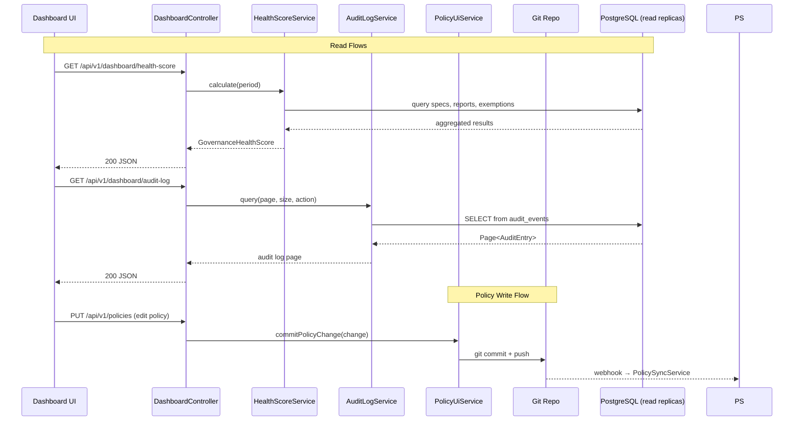

# Dashboard Architecture

> **Module location:** `keystone-server` (this repository)
> **Language:** Java 21 + Spring Boot
> **Package:** `com.keystone.dashboard`
> **Guardian validators:** @PreAuthorize, layer compliance

## Overview

Provides visualization of governance health, policy compliance, audit trails, and system metrics. Supports RBAC-filtered views per actor type (Platform Engineer, API Owner, Compliance Manager). Reads from all other bounded contexts via Spring `@Service` beans — no domain events emitted (read-only).

## Responsibilities

- Display governance health score and compliance trends
- Show spec compliance history per API/service
- Visualize policy violation trends over time
- Provide audit trail browsing (event sourcing replay)
- Render dependency graph visualizations
- Support RBAC-filtered views per actor role
- Serve as the UI entry point for the Dashboard web application
- Commit policy changes to Git (when compliance manager edits policies via UI)

## Components {#components}

| Component | Java Class | Purpose | Canonical Section |
|-----------|-----------|---------|-------------------|
| DashboardController | `DashboardController.java` | REST API endpoints for dashboard data | #dashboard-controller |
| HealthScoreService | `HealthScoreService.java` | Compute GovernanceHealthScore from raw metrics | #health-score-service |
| AuditLogService | `AuditLogService.java` | Query append-only audit event store | #audit-log-service |
| PolicyUiService | `PolicyUiService.java` | Commits policy changes to Git repo on behalf of UI | #policy-ui-service |
| DashboardExceptionHandler | `DashboardExceptionHandler.java` | @RestControllerAdvice for dashboard errors | #error-handling |

---

## Component Details {#component-details}

### DashboardController {#dashboard-controller}

**Purpose:** REST API for all dashboard views. Enforces RBAC via `@PreAuthorize`.

**Implementation File:** `src/main/java/com/keystone/dashboard/controller/DashboardController.java`

**Interface:**

```java
@RestController
@RequestMapping("/api/v1/dashboard")
public class DashboardController {

    @Autowired private HealthScoreService healthScoreService;
    @Autowired private AuditLogService auditLogService;

    @GetMapping("/health-score")
    @PreAuthorize("hasAnyRole('VIEWER', 'COMPLIANCE_MANAGER')")
    public ResponseEntity<GovernanceHealthScore> getHealthScore(
            @RequestParam(defaultValue = "LAST_30_DAYS") String period) {
        return ResponseEntity.ok(healthScoreService.calculate(period));
    }

    @GetMapping("/compliance-history/{specId}")
    @PreAuthorize("hasAnyRole('VIEWER', 'COMPLIANCE_MANAGER')")
    public ResponseEntity<List<ComplianceSummary>> getComplianceHistory(
            @PathVariable String specId,
            @RequestParam(defaultValue = "30") int days) {
        return ResponseEntity.ok(healthScoreService.getComplianceHistory(specId, days));
    }

    @GetMapping("/audit-log")
    @PreAuthorize("hasRole('COMPLIANCE_MANAGER')")
    public ResponseEntity<Page<AuditEntry>> getAuditLog(
            @RequestParam(defaultValue = "0") int page,
            @RequestParam(defaultValue = "50") int size,
            @RequestParam(required = false) String action) {
        return ResponseEntity.ok(auditLogService.query(page, size, action));
    }

    @GetMapping("/violation-trends")
    @PreAuthorize("hasAnyRole('VIEWER', 'COMPLIANCE_MANAGER')")
    public ResponseEntity<List<ViolationTrend>> getViolationTrends(
            @RequestParam(defaultValue = "90") int days) {
        return ResponseEntity.ok(healthScoreService.getViolationTrends(days));
    }
}
```

### HealthScoreService {#health-score-service}

**Purpose:** Computes the GovernanceHealthScore from data across all contexts.

**Implementation File:** `src/main/java/com/keystone/dashboard/service/HealthScoreService.java`

**Interface:**

```java
@Service
public class HealthScoreService {

    @Autowired private SpecRepository specRepository;         // from ingestion schema
    @Autowired private PolicyRepository policyRepository;     // from policy schema
    @Autowired private ChangeReportRepository reportRepository; // from analysis schema

    public GovernanceHealthScore calculate(String period) {
        Instant since = switch (period) {
            case "LAST_30_DAYS" -> Instant.now().minus(30, ChronoUnit.DAYS);
            case "LAST_90_DAYS" -> Instant.now().minus(90, ChronoUnit.DAYS);
            default -> throw new IllegalArgumentException("Unknown period: " + period);
        };

        long totalSpecs = specRepository.countByIngestedAfter(since);
        long passingSpecs = specRepository.countPassingAfter(since);
        double specComplianceRate = totalSpecs > 0 ? (double) passingSpecs / totalSpecs : 1.0;

        long totalEvaluations = reportRepository.countByEvaluatedAfter(since);
        long passingEvaluations = reportRepository.countPassingAfter(since);
        double policyPassRate = totalEvaluations > 0 ? (double) passingEvaluations / totalEvaluations : 1.0;

        long activeExemptions = policyRepository.countActiveExemptions();
        long totalBreakingChanges = reportRepository.countBreakingChangesAfter(since);
        double exemptionRate = totalBreakingChanges > 0 ? (double) activeExemptions / totalBreakingChanges : 0.0;

        double score = specComplianceRate * 0.4 + policyPassRate * 0.4 + (1 - exemptionRate) * 0.2;

        return new GovernanceHealthScore(score, period, totalSpecs, specComplianceRate,
            policyPassRate, exemptionRate);
    }
}
```

### PolicyUiService {#policy-ui-service}

**Purpose:** When a compliance manager edits policies via the Dashboard UI, this service commits the changes to the Git repository (not directly to the database).

**Implementation File:** `src/main/java/com/keystone/dashboard/service/PolicyUiService.java`

**Interface:**

```java
@Service
public class PolicyUiService {

    @Value("${policy.git.repository}")
    private String policyRepoUrl;

    @Value("${policy.git.deploy-key}")
    private String deployKeyPath;

    @PreAuthorize("hasRole('COMPLIANCE_MANAGER')")
    public void commitPolicyChange(PolicyChange change) {
        // 1. Clone / pull policy repo
        // 2. Apply the change to the YAML file
        // 3. Run git commit with change.message()
        // 4. Push to remote (triggers webhook → PolicySyncService)
        // The database cache is updated async by PolicySyncService
    }
}
```

---

## Data Flow {#data-flow}



---

## Dependencies {#dependencies}

### Depends On
- **Contract Ingestion**: Read spec metadata via `SpecRepository`
- **Breaking Change Analysis**: Read report history via `ChangeReportRepository`
- **Policy Engine**: Read compliance history and exemptions via `PolicyRepository`
- **Notification Engine**: Read notification history via `NotificationRepository`
- **Dependency Graph**: Read graph data via `GraphRepository`
- **Audit Event Store**: Read audit entries via `AuditLogRepository`

### Used By
- **Users (Platform Engineers, API Owners, Compliance Managers)**: Web UI

---

## Security Considerations {#security}

| Concern | Mitigation | Validator |
|---------|------------|-----------|
| Unauthorized data access | `@PreAuthorize` on every endpoint: VIEWER, COMPLIANCE_MANAGER, ADMIN roles | security-validator |
| Sensitive data exposure | No spec content exposed; only metadata and compliance status | security-validator |
| Policy write access | Only COMPLIANCE_MANAGER can commit policy changes | security-validator |

**Role Access Matrix:**

| Endpoint | Platform Engineer | API Owner | Compliance Manager |
|----------|-----------------|-----------|-------------------|
| Health score | ✓ | ✓ | ✓ |
| Compliance history | ✓ | ✓ (own specs) | ✓ (all) |
| Audit log | ✗ | ✗ | ✓ |
| Policy editor | ✗ | ✗ | ✓ |
| Violation trends | ✓ | ✓ | ✓ |

---

## Testing Requirements {#testing}

| Test Type | Coverage Target | Approach |
|-----------|-----------------|----------|
| Unit | 85% | JUnit 5 + Mockito for HealthScoreService, AuditLogService |
| Integration | 75% | @SpringBootTest with Testcontainers; mock Git operations |
| E2E | 60% | Full dashboard page load with real data |

**Key Test Scenarios:**
- Health score calculation with various data states (all passing, some failing, all failing)
- RBAC: API owner sees only their specs; compliance manager sees all
- Audit log pagination and filtering by action type
- Policy UI commit: change committed to Git repo (mock SSH)

---

## Error Handling {#error-handling}

```java
@RestControllerAdvice
public class DashboardExceptionHandler {

    @ExceptionHandler(AccessDeniedException.class)
    public ResponseEntity<ErrorResponse> handleAccessDenied(AccessDeniedException ex) {
        return ResponseEntity.status(403).body(
            new ErrorResponse("FORBIDDEN", "Insufficient permissions"));
    }

    @ExceptionHandler(IllegalArgumentException.class)
    public ResponseEntity<ErrorResponse> handleBadRequest(IllegalArgumentException ex) {
        return ResponseEntity.badRequest().body(
            new ErrorResponse("BAD_REQUEST", ex.getMessage()));
    }
}
```

---

## Performance Considerations {#performance}

| Metric | Target | Monitoring |
|--------|--------|------------|
| Dashboard page load | <500ms p95 | Micrometer `dashboard.page.time` timer |
| Health score calculation | <200ms | Micrometer `dashboard.health-score.time` timer |
| Audit log query (30 days, 50 items) | <2s | Micrometer `dashboard.audit-log.time` timer |

---

*Last updated: 2026-06-12*
*Module version: v0.1.0*
*Canonical anchors: #components, #component-details, #dashboard-controller, #health-score-service, #policy-ui-service, #data-flow, #dependencies, #security, #testing, #error-handling, #performance*
