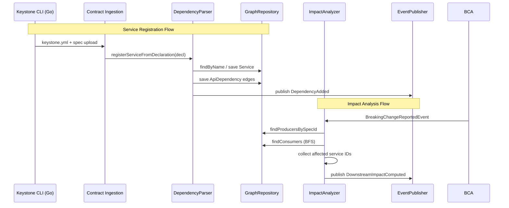

# Dependency Graph Architecture

> **Module location:** `keystone-server` (this repository)
> **Language:** Java 21 + Spring Boot
> **Package:** `com.keystone.graph`
> **Guardian validators:** package rings, canonical references
> ⚠ v1 only supports explicit declarations via `keystone.yml`. Automated discovery via service mesh or Kubernetes labels is deferred.

## Overview

Tracks which services consume/produce which API specs. Computes impact analysis for breaking changes. For v1, consumer relationships are declared explicitly via `keystone.yml` files placed in each service repository. Uses BFS graph traversal for impact analysis.

## Responsibilities

- Register services and their API dependencies from `keystone.yml` declarations
- Maintain a directed graph of producer-consumer relationships in PostgreSQL
- Compute impact analysis: BFS traversal to find all downstream consumers affected by a breaking change
- Publish `DependencyAdded` and `DownstreamImpactComputed` events
- Expose graph queries for Dashboard visualization

## Components {#components}

| Component | Java Class | Purpose | Canonical Section |
|-----------|-----------|---------|-------------------|
| GraphRepository | `GraphRepository.java` | JPA repository for Service nodes and ApiDependency edges | #graph-repository |
| ImpactAnalyzer | `ImpactAnalyzer.java` | BFS traversal to find affected downstream services | #impact-analyzer |
| DependencyParser | `DependencyParser.java` | Parse `keystone.yml` files for dependency declarations | #dependency-parser |
| GraphController | `GraphController.java` | REST API for graph queries | #graph-controller |

---

## Component Details {#component-details}

### ImpactAnalyzer {#impact-analyzer}

**Purpose:** Given a breaking change to a spec, find all downstream consumers via BFS traversal.

**Implementation File:** `src/main/java/com/keystone/graph/analysis/ImpactAnalyzer.java`

**Interface:**

```java
@Service
public class ImpactAnalyzer {

    @Autowired private GraphRepository graphRepository;
    @Autowired private ApplicationEventPublisher eventPublisher;

    @EventListener
    public ImpactAnalysisResult onBreakingChangeReported(BreakingChangeReportedEvent event) {
        // Find the spec that was changed
        String specId = event.getSpecId();

        // BFS traversal: find all consumers that depend on this spec
        Set<UUID> affectedServiceIds = new HashSet<>();
        Queue<Service> queue = new LinkedList<>();
        Set<UUID> visited = new HashSet<>();

        // Start with services that produce this spec
        List<Service> producers = graphRepository.findProducersBySpecId(specId);
        queue.addAll(producers);

        while (!queue.isEmpty()) {
            Service current = queue.poll();
            if (!visited.add(current.getId())) continue;

            // Find all consumers of this service's APIs
            List<ApiDependency> consumers = graphRepository.findConsumers(current.getId());
            for (ApiDependency dep : consumers) {
                Service consumer = dep.getConsumer();
                if (!visited.contains(consumer.getId())) {
                    affectedServiceIds.add(consumer.getId());
                    queue.add(consumer);
                }
            }
        }

        ImpactAnalysisResult result = new ImpactAnalysisResult(
            event.getReportId(), affectedServiceIds);
        eventPublisher.publishEvent(new DownstreamImpactComputedEvent(result));
        return result;
    }
}
```

### GraphRepository {#graph-repository}

**Purpose:** JPA data access for Service nodes and ApiDependency edges.

**Implementation File:** `src/main/java/com/keystone/graph/repository/GraphRepository.java`

**Interface:**

```java
@Repository
public interface GraphRepository extends JpaRepository<Service, UUID> {

    @Query("SELECT s FROM Service s WHERE s.id IN " +
           "(SELECT d.producer FROM ApiDependency d WHERE d.specId = :specId)")
    List<Service> findProducersBySpecId(@Param("specId") String specId);

    @Query("SELECT d FROM ApiDependency d WHERE d.producer.id = :serviceId")
    List<ApiDependency> findConsumers(@Param("serviceId") UUID serviceId);

    @Query("SELECT d FROM ApiDependency d WHERE d.consumer.id = :serviceId")
    List<ApiDependency> findDependencies(@Param("serviceId") UUID serviceId);

    Optional<Service> findByName(String name);
}
```

### DependencyParser {#dependency-parser}

**Purpose:** Parses `keystone.yml` declarations from the CLI upload payload.

**Implementation File:** `src/main/java/com/keystone/graph/parser/DependencyParser.java`

**Interface:**

```java
@Component
public class DependencyParser {

    @Autowired private GraphRepository graphRepository;
    @Autowired private ApplicationEventPublisher eventPublisher;

    public void registerServiceFromDeclaration(ServiceDeclaration decl) {
        Service service = graphRepository.findByName(decl.name())
            .orElseGet(() -> graphRepository.save(
                new Service(decl.name(), decl.team())));

        for (SpecProduced produced : decl.produces()) {
            // Register producer relationships
            ApiDependency dep = new ApiDependency(
                service.getId(), null, produced.specPath());
            graphRepository.saveDependency(dep);
        }

        for (SpecConsumed consumed : decl.consumes()) {
            Service producer = graphRepository.findByName(consumed.service())
                .orElseThrow(() -> new UnknownServiceException(
                    "Consumer " + decl.name() + " depends on unknown service: "
                    + consumed.service()));
            // Register consumer → producer edge (already handles unique constraint)
            ApiDependency dep = new ApiDependency(
                producer.getId(), service.getId(), consumed.specPath());
            graphRepository.saveDependency(dep);
        }

        eventPublisher.publishEvent(new DependencyAddedEvent(decl.name()));
    }
}
```

---

## Data Flow {#data-flow}



---

## Dependencies {#dependencies}

### Depends On
- **Contract Ingestion**: Receives `keystone.yml` declaration via spec upload

### Used By
- **Breaking Change Analysis**: Impact analysis queries `GraphRepository`
- **Dashboard**: Graph visualization and impact reports

---

## Security Considerations {#security}

| Concern | Mitigation | Validator |
|---------|------------|-----------|
| Unauthorized service registration | Only registered via CLI upload (authenticated by API token) | security-validator |
| Graph data integrity | Unique constraint on (producer, consumer, spec_path) prevents duplicate edges | security-validator |

---

## Testing Requirements {#testing}

| Test Type | Coverage Target | Approach |
|-----------|-----------------|----------|
| Unit | 85% | JUnit 5 for ImpactAnalyzer BFS, DependencyParser |
| Integration | 75% | @SpringBootTest with PostgreSQL (Testcontainers) |
| Performance | — | JMH: 500-node BFS <50ms |

**Key Test Scenarios:**
- Single consumer: change to spec A → only direct consumer B is affected
- Cascading: change to spec A → B depends on A → C depends on B → both B and C affected
- No consumers: change to spec with no dependents → empty result
- Circular dependency: A→B→A → BFS does not infinite loop (visited set)

---

## Error Handling {#error-handling}

```java
public class UnknownServiceException extends RuntimeException {
    public UnknownServiceException(String message) {
        super(message);
    }
}

public class DuplicateDependencyException extends RuntimeException {
    public DuplicateDependencyException(String producer, String consumer) {
        super("Duplicate dependency: " + producer + " → " + consumer);
    }
}
```

**Error Recovery:**
- UnknownServiceException: skip dependency, log error, continue parsing remaining declarations
- DuplicateDependencyException: idempotent — ignore duplicate, no error

---

## Performance Considerations {#performance}

| Metric | Target | Monitoring |
|--------|--------|------------|
| Impact analysis for 500-node graph | <50ms | Micrometer `graph.impact.time` timer |
| Service registration latency | <20ms | Micrometer `graph.registration.time` timer |
| Graph propagation (webhook → graph update) | <30s | Event timing |

---

*Last updated: 2026-06-12*
*Module version: v0.1.0*
*Canonical anchors: #components, #component-details, #impact-analyzer, #graph-repository, #dependency-parser, #data-flow, #dependencies, #security, #testing, #error-handling, #performance*
