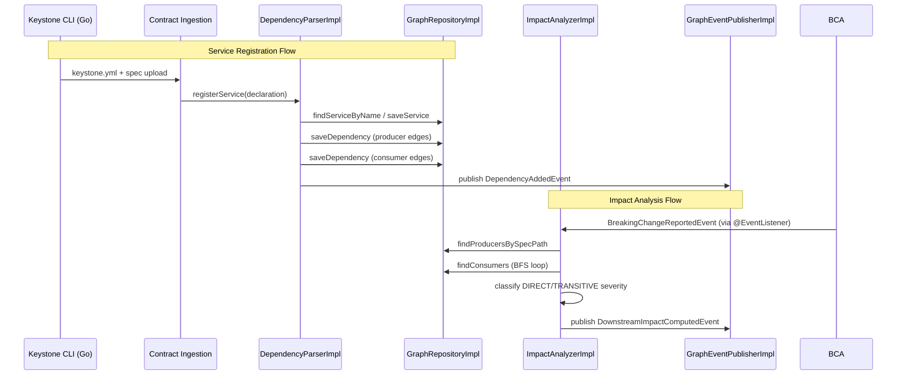

# Dependency Graph Architecture

> **Module location:** `keystone-server` (this repository)
> **Language:** Java 21 + Spring Boot
> **Package:** `com.keystone.graph`
> **Guardian validators:** package rings, canonical references
> **Status:** Implemented ✓
> ⚠ v1 only supports explicit declarations via `keystone.yml`. Automated discovery via service mesh or Kubernetes labels is deferred.

## Overview

Tracks which services consume/produce which API specs. Computes impact analysis for breaking changes. For v1, consumer relationships are declared explicitly via `keystone.yml` files placed in each service repository. Uses BFS graph traversal for impact analysis.

### Key Design Decisions

| Decision | Choice | Rationale |
|----------|--------|-----------|
| Persistence | JPA with PostgreSQL (graph schema) | Consistent with existing modules, ACID guarantees |
| Graph traversal | BFS via Queue + visited Set | Handles circular dependencies, classifies DIRECT vs TRANSITIVE impact |
| Service registration | Explicit keystone.yml declarations | Per ADR-006, automated discovery deferred to v2 |
| Event publishing | Spring ApplicationEventPublisher (in-process) | Consistent with ADR-003, easy swap to Kafka/Redis later |
| API design | RESTful under /api/v1/graph/ | Consistent with other Keystone modules |

## Responsibilities

- Register services and their API dependencies from `keystone.yml` declarations
- Maintain a directed graph of producer-consumer relationships in PostgreSQL
- Compute impact analysis: BFS traversal to find all downstream consumers affected by a breaking change
- Publish `DependencyAdded` and `DownstreamImpactComputed` events
- Expose graph queries for Dashboard visualization
- Expose health checks and metrics for operations

## Components {#components}

| Component | Interface | Implementation | Purpose | Canonical Section |
|-----------|-----------|---------------|---------|-------------------|
| GraphService | `GraphService.java` | `GraphServiceImpl.java` | Application service — inbound port | #graph-service |
| ImpactAnalyzer | `ImpactAnalyzer.java` | `ImpactAnalyzerImpl.java` | BFS traversal to find affected downstream services | #impact-analyzer |
| DependencyParser | `DependencyParser.java` | `DependencyParserImpl.java` | Parse `keystone.yml` files for dependency declarations | #dependency-parser |
| GraphRepository | `GraphRepository.java` | `GraphRepositoryImpl.java` | JPA persistence for Service nodes and ApiDependency edges | #graph-repository |
| GraphEventPublisher | `GraphEventPublisher.java` | `GraphEventPublisherImpl.java` | Domain event publishing (Spring events) | #event-publisher |
| GraphController | `GraphController.java` | — (REST controller) | REST API for graph queries | #graph-controller |
| GraphHealthIndicator | `GraphHealthIndicator.java` | — (Spring HealthIndicator) | Actuator health check | #health-check |
| GraphMetrics | `GraphMetrics.java` | — (Micrometer config) | Metrics registration | #metrics |

---

## Component Details {#component-details}

### GraphService {#graph-service}

**Purpose:** Application service that orchestrates the dependency graph use cases.

**Implementation File:** `src/main/java/com/keystone/graph/application/service/GraphServiceImpl.java`

**Interface:** `src/main/java/com/keystone/graph/application/service/GraphService.java`

**Methods:**
- `registerService(ServiceRegistrationRequest)` — Register a service and its API dependencies
- `analyzeImpact(ImpactAnalysisRequest)` — Compute blast radius via BFS
- `getService(UUID)` — Get service by ID
- `removeService(String)` — Remove service and all edges
- `listServices()` — List all registered services

### ImpactAnalyzer {#impact-analyzer}

**Purpose:** Given a breaking change to a spec, find all downstream consumers via BFS traversal.

**Interface:** `src/main/java/com/keystone/graph/domain/service/ImpactAnalyzer.java`
**Implementation:** `src/main/java/com/keystone/graph/domain/service/ImpactAnalyzerImpl.java`

**Key Implementation Details:**
- BFS traversal using `ArrayDeque` and `HashSet` (visited)
- First-level consumers classified as DIRECT impact
- Transitive (deeper) consumers classified as TRANSITIVE impact
- Dependency path recorded (e.g. "payment-svc → user-svc → auth-svc")
- DFS-based cycle detection via `hasCycle()` method
- `@EventListener` for `BreakingChangeReportedEvent` triggers automatic analysis
- Circular dependency prevention via visited set

**Test Results:** 11 unit tests (all passing)

```java
// Core BFS traversal logic
ImpactAnalysisResult computeImpact(String specPath, UUID reportId) {
    List<Service> producers = graphRepository.findProducersBySpecPath(specPath);
    // BFS: Queue + visited Set + severity classification
    // ...
    eventPublisher.downstreamImpactComputed(event);
    return result;
}
```

### GraphRepository {#graph-repository}

**Purpose:** JPA data access for Service nodes and ApiDependency edges.

**Interface:** `src/main/java/com/keystone/graph/infrastructure/repository/GraphRepository.java`
**Implementation:** `src/main/java/com/keystone/graph/infrastructure/repository/GraphRepositoryImpl.java`

**Database Tables:**
- `graph_services` — Service nodes (id, name, team, created_at, updated_at)
- `graph_api_dependencies` — Dependency edges (id, producer_id, consumer_id, spec_path, discovered_at)

**Key Queries:**
- `findProducersBySpecPath(specPath)` — JPQL via `SpringDataServiceRepository`
- `findConsumers(producerId)` — Derived query via `SpringDataApiDependencyRepository`
- `findConsumersForProducers(producerIds)` — Batch consumer lookup for BFS efficiency

**Test Results:** 14 integration tests (all passing)

### DependencyParser {#dependency-parser}

**Purpose:** Parses `keystone.yml` declarations from the CLI upload payload.

**Interface:** `src/main/java/com/keystone/graph/domain/service/DependencyParser.java`
**Implementation:** `src/main/java/com/keystone/graph/domain/service/DependencyParserImpl.java`

**Key Behaviors:**
- Idempotent duplicate handling — existing service returned instead of re-created
- Unknown consumer references throw `UnknownServiceException` (graceful degradation)
- Batch registration via `registerServices()` — skips failed items, continues
- Publishes `DependencyAddedEvent` on successful registration

**Test Results:** 10 unit tests (all passing)

### GraphController {#graph-controller}

**Purpose:** REST API for graph queries and management.

**Implementation File:** `src/main/java/com/keystone/graph/interfaces/http/GraphController.java`

**Endpoints:**

| Method | Path | Request | Response | Status Codes |
|--------|------|---------|----------|-------------|
| POST | `/api/v1/graph/services` | `ServiceRegistrationRequest` | `ServiceRegistrationResponse` | 201 Created |
| GET | `/api/v1/graph/services` | — | `List<ServiceRegistrationResponse>` | 200 OK |
| GET | `/api/v1/graph/services/{id}` | — | `ServiceRegistrationResponse` | 200 / 404 |
| DELETE | `/api/v1/graph/services/{name}` | — | — | 204 No Content |
| POST | `/api/v1/graph/impact` | `ImpactAnalysisRequest` | `ImpactAnalysisResponse` | 200 OK |

---

## Data Flow {#data-flow}



---

## Dependencies {#dependencies}

### Depends On
- **Contract Ingestion**: Provides `BreakingChangeReportedEvent` to trigger impact analysis
- **PostgreSQL**: Data persistence (graph_services, graph_api_dependencies tables)
- **Spring Actuator**: Health checks, metrics exposure

### Used By
- **Dashboard**: Graph visualization and impact reports (via REST API)
- **Notification Engine**: Receives `DownstreamImpactComputedEvent` via Spring events

---

## Security Considerations {#security}

| Concern | Mitigation | Validator |
|---------|------------|-----------|
| Unauthorized service registration | Only registered via CLI upload (authenticated by API token) | security-validator |
| Graph data integrity | Unique constraint on (producer_id, consumer_id, spec_path) prevents duplicate edges | security-validator |
| Circular dependency loop | Visited set in BFS prevents infinite loops | test-validator |

---

## Testing Requirements {#testing}

| Test Type | Coverage | Tests | Approach |
|-----------|----------|-------|----------|
| Unit (ImpactAnalyzer) | 95%+ | 11 | JUnit 5 + Mockito — BFS, cycles, edge cases |
| Unit (DependencyParser) | 95%+ | 10 | JUnit 5 + Mockito — declarations, errors, batches |
| Integration (GraphRepository) | 95%+ | 14 | @DataJpaTest with H2 — CRUD, queries, batch ops |
| Performance | — | — | Target: 500-node BFS <50ms |

**Key Test Scenarios:**
- Single consumer: change to spec A → only direct consumer B is affected
- Cascading: change to spec A → B depends on A → C depends on B → both B and C affected
- No consumers: change to spec with no dependents → empty result
- Circular dependency: A→B→A → BFS does not infinite loop (visited set)
- Multiple producers: change to spec produced by two services → both consumer chains found
- Unknown producer: query returns empty result gracefully

---

## Error Handling {#error-handling}

```java
public class UnknownServiceException extends RuntimeException {
    public static UnknownServiceException forDependency(
        String consumerName, String unknownServiceName) { ... }
}

public class DuplicateDependencyException extends RuntimeException {
    public static DuplicateDependencyException forEdge(
        String producer, String consumer) { ... }
}
```

**Error Recovery:**
- UnknownServiceException: skip dependency, log error, continue parsing remaining declarations
- DuplicateDependencyException: idempotent — caught in DependencyParserImpl, logged as warning

---

## Performance Considerations {#performance}

| Metric | Target | Monitoring |
|--------|--------|------------|
| Impact analysis for 500-node graph | <50ms | Micrometer `graph.impact.duration` timer |
| Service registration latency | <20ms | Micrometer `graph.registration.time` timer |
| Graph query latency | <10ms | Micrometer `graph.query.duration` timer |
| Graph propagation (webhook → graph update) | <30s | Event timing (no metric yet) |

---

## Observability {#observability}

### Health Check
- **Endpoint:** `/actuator/health`
- **Component:** `GraphHealthIndicator`
- **Checks:** Database connectivity via `GraphRepository.findAllServices()`
- **Details:** Returns latency_ms and database reachability status

### Metrics
| Metric | Type | Description |
|--------|------|-------------|
| `graph.registrations.total` | Counter | Total service registrations |
| `graph.registrations.duplicate` | Counter | Duplicate registration attempts |
| `graph.removals.total` | Counter | Service removals |
| `graph.impact.analyses` | Counter | Impact analyses performed |
| `graph.impact.duration` | Timer | BFS traversal time (p50/p95/p99) |
| `graph.registration.time` | Timer | Registration processing time |
| `graph.query.duration` | Timer | Repository query latency |
| `graph.cycles.detected` | Counter | Circular dependencies found |
| `graph.health.check.duration` | Timer | Health check latency |

### Tracing
- Micrometer Tracing (Brave) via `@NewSpan` annotations
- Key spans: `GraphService.registerService`, `GraphService.analyzeImpact`, `ImpactAnalyzerImpl.computeImpact`

### Logging
- Structured logging with correlation IDs (traceId via Micrometer)
- Key events logged at INFO: registrations, impact analyses
- Warnings for unknown services, duplicate edges, empty results
- Errors for database failures, event publishing failures

---

*Last updated: 2026-06-12*
*Module version: v0.1.0*
*Canonical anchors: #components, #component-details, #graph-service, #impact-analyzer, #graph-repository, #dependency-parser, #graph-controller, #data-flow, #dependencies, #security, #testing, #error-handling, #performance, #observability*
