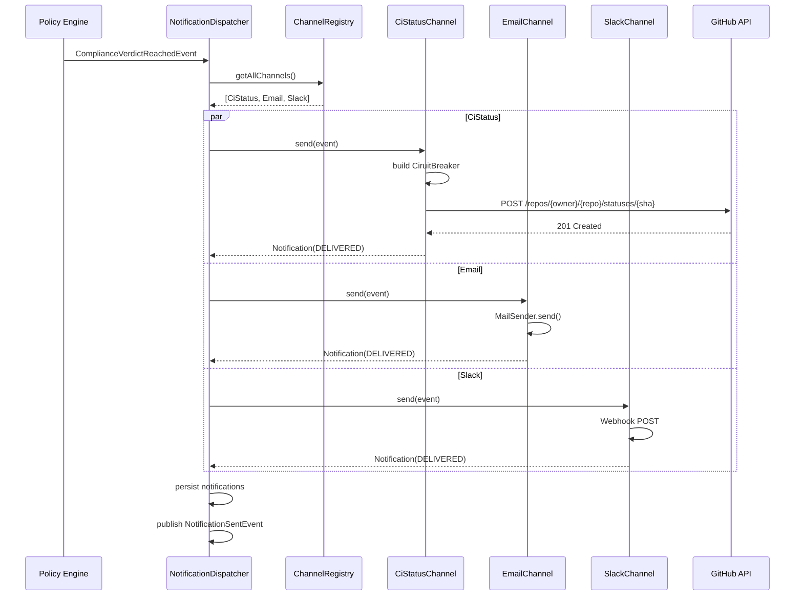

# Notification Engine Architecture

> **Module location:** `keystone-server` (this repository)
> **Language:** Java 21 + Spring Boot
> **Package:** `com.keystone.notification`
> **Guardian validators:** @Transactional, circuit breaker (Resilience4j)

## Overview

Sends notifications to external systems: GitHub/GitLab commit status APIs, email, and Slack. Manages delivery channels with retry logic, circuit breakers (Resilience4j), and idempotency. Subscribes to `ComplianceVerdictReached` and `ExemptionGranted` events via Spring `@EventListener`.

## Responsibilities

- Subscribe to `ComplianceVerdictReached` and `ExemptionGranted` events
- Post CI status updates (pending/success/failure/error) to GitHub/GitLab commit status API
- Send email and Slack notifications to API owners and compliance managers
- Manage delivery channels with retry (exponential backoff) and circuit breakers (Resilience4j)
- Ensure idempotent notifications (no duplicate CI status posts via event sourcing)
- Queue failed notifications for replay

## Components {#components}

| Component | Java Class | Purpose | Canonical Section |
|-----------|-----------|---------|-------------------|
| NotificationDispatcher | `NotificationDispatcher.java` | Routes events to appropriate channels | #notification-dispatcher |
| CiStatusChannel | `channel/CiStatusChannel.java` | GitHub/GitLab commit status API integration | #ci-status-channel |
| EmailChannel | `channel/EmailChannel.java` | Email delivery via Spring MailSender | #email-channel |
| SlackChannel | `channel/SlackChannel.java` | Slack webhook integration | #slack-channel |
| ChannelRegistry | `ChannelRegistry.java` | Register/manage notification channels | #channel-registry |
| NotificationRepository | `NotificationRepository.java` | JPA repository for Notification events | #notification-repository |

---

## Component Details {#component-details}

### NotificationDispatcher {#notification-dispatcher}

**Purpose:** Receives compliance verdicts and dispatches to all registered channels.

**Implementation File:** `src/main/java/com/keystone/notification/dispatcher/NotificationDispatcher.java`

**Interface:**

```java
@Service
public class NotificationDispatcher {

    @Autowired private ChannelRegistry channelRegistry;
    @Autowired private NotificationRepository notificationRepository;
    @Autowired private ApplicationEventPublisher eventPublisher;

    @EventListener
    public void onComplianceVerdict(ComplianceVerdictReachedEvent event) {
        dispatchToAllChannels(event);
    }

    @EventListener
    public void onExemptionGranted(ExemptionGrantedEvent event) {
        dispatchToAllChannels(event);
    }

    private void dispatchToAllChannels(Object event) {
        for (NotificationChannel channel : channelRegistry.getAllChannels()) {
            try {
                Notification notification = channel.send(event);
                notificationRepository.save(notification);
                eventPublisher.publishEvent(new NotificationSentEvent(notification));
            } catch (Exception ex) {
                log.error("Channel {} failed for event {}", channel.getName(), event, ex);
                notificationRepository.save(new Notification(channel.getName(), "FAILED", ex.getMessage()));
            }
        }
    }
}
```

### CiStatusChannel {#ci-status-channel}

**Purpose:** Posts commit status to GitHub/GitLab commit status API with Resilience4j circuit breaker.

**Implementation File:** `src/main/java/com/keystone/notification/channel/CiStatusChannel.java`

**Interface:**

```java
@Component
public class CiStatusChannel implements NotificationChannel {

    @Autowired private RestTemplate restTemplate;
    @Autowired private CircuitBreaker circuitBreaker;  // Resilience4j

    @Value("${github.api.base-url}")
    private String githubApiBaseUrl;

    @Value("${github.token}")
    private String githubToken;

    @Override
    public String getName() { return "CI_STATUS"; }

    @Override
    public Notification send(Object event) {
        CiStatusPayload payload = buildPayload(event);
        return circuitBreaker.executeSupplier(() -> {
            ResponseEntity<Void> response = restTemplate.exchange(
                githubApiBaseUrl + "/repos/{owner}/{repo}/statuses/{sha}",
                HttpMethod.POST,
                new HttpEntity<>(payload, buildHeaders()),
                Void.class,
                payload.owner(), payload.repo(), payload.sha()
            );
            return new Notification("CI_STATUS", "DELIVERED",
                "Status: " + response.getStatusCode());
        }, throwable -> {
            return new Notification("CI_STATUS", "FAILED",
                "Circuit breaker: " + throwable.getMessage());
        });
    }
}

public record CiStatusPayload(
    String state,        // "pending" | "success" | "failure" | "error"
    String description,
    String targetUrl,
    String context       // "keystone/governance"
) {}
```

### ChannelRegistry {#channel-registry}

**Purpose:** Manages registered notification channels.

**Implementation File:** `src/main/java/com/keystone/notification/registry/ChannelRegistry.java`

**Interface:**

```java
@Component
public class ChannelRegistry {

    @Autowired private List<NotificationChannel> channels;

    public List<NotificationChannel> getAllChannels() { return channels; }

    public NotificationChannel getChannel(String name) {
        return channels.stream()
            .filter(c -> c.getName().equals(name))
            .findFirst()
            .orElseThrow(() -> new IllegalArgumentException("Unknown channel: " + name));
    }
}

public interface NotificationChannel {
    String getName();
    Notification send(Object event);
}
```

---

## Data Flow {#data-flow}



---

## Dependencies {#dependencies}

### Depends On
- **Policy Engine**: Subscribes to `ComplianceVerdictReached` and `ExemptionGranted` events

### Used By
- **GitHub / GitLab**: Receives commit status updates
- **Dashboard**: Reads notification history

---

## Security Considerations {#security}

| Concern | Mitigation | Validator |
|---------|------------|-----------|
| GitHub token leakage | `@Value` from environment variable (not code); token has minimal `statuses:write` scope | security-validator |
| Email credentials | Spring MailSender with encrypted password in Vault/Secrets Manager | security-validator |
| Slack webhook abuse | Webhook URL stored in Secrets Manager; rotated monthly | security-validator |

---

## Testing Requirements {#testing}

| Test Type | Coverage Target | Approach |
|-----------|-----------------|----------|
| Unit | 85% | JUnit 5 + Mockito for dispatcher, circuit breaker |
| Integration | 75% | @SpringBootTest with WireMock for GitHub API |
| E2E | 60% | Full flow: verdict → CI status appears on PR |

**Key Test Scenarios:**
- CI status: success/failure posted correctly to GitHub
- Circuit breaker: GitHub API returns 429 → circuit opens → fallback `FAILED` notification
- Retry: failed notification is retried with exponential backoff (up to 3 retries)
- Idempotency: same commit SHA + same state → GitHub returns no-op (API handles this)

---

## Error Handling {#error-handling}

```java
public class NotificationDeliveryException extends RuntimeException {
    private final String channel;
    private final int retryAttempt;

    public NotificationDeliveryException(String channel, String message, int retryAttempt) {
        super("Channel " + channel + " failed after " + retryAttempt + " retries: " + message);
        this.channel = channel;
        this.retryAttempt = retryAttempt;
    }
}

public class CircuitBreakerOpenException extends RuntimeException {
    public CircuitBreakerOpenException(String channel) {
        super("Circuit breaker open for channel: " + channel);
    }
}
```

**Error Recovery:**
- CircuitBreakerOpenException: log warning, try again on next event (circuit half-opens after 30s)
- NotificationDeliveryException: 3 retries with exponential backoff (1s, 4s, 10s), then discard
- Channel failure: other channels continue unaffected (parallel dispatch)

---

## Performance Considerations {#performance}

| Metric | Target | Monitoring |
|--------|--------|------------|
| Status API call timeout | 2s (Resilience4j TimeLimiter) | Micrometer `notification.ci-status.time` |
| Circuit breaker: open duration | 30s | Micrometer `notification.circuit-breaker.state` |
| Notification persistence latency | <10ms | Micrometer `notification.persist.time` |

---

*Last updated: 2026-06-12*
*Module version: v0.1.0*
*Canonical anchors: #components, #component-details, #notification-dispatcher, #ci-status-channel, #channel-registry, #data-flow, #dependencies, #security, #testing, #error-handling, #performance*
