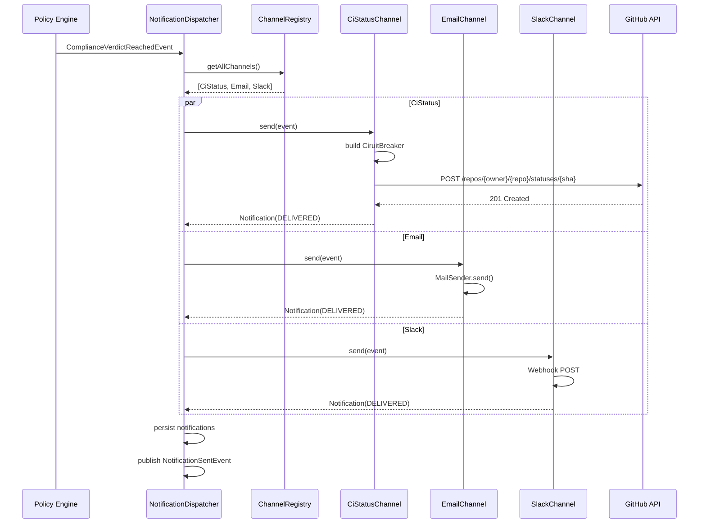

# Notification Engine Architecture

> **Module location:** `keystone-server` (this repository)
> **Language:** Java 21 + Spring Boot
> **Package:** `com.keystone.notification`
> **Guardian validators:** @Transactional, circuit breaker (Resilience4j)

## Overview

Sends notifications to external systems: GitHub/GitLab commit status APIs, email, and Slack. Manages delivery channels with retry logic, circuit breakers (Resilience4j), and idempotency. Subscribes to `ComplianceVerdictReached` and `ExemptionGranted` events via Spring `@EventListener`.

## Responsibilities

- Subscribe to `ComplianceVerdictReached` and `ExemptionGranted` events
- Post CI status updates (pending/success/failure/error) to GitHub/GitLab commit status API
- Send email and Slack notifications to API owners and compliance managers
- Manage delivery channels with retry (exponential backoff) and circuit breakers (Resilience4j)
- Ensure idempotent notifications (no duplicate CI status posts via event sourcing)
- Queue failed notifications for replay

## Components {#components}

| Component | Interface | Implementation | Purpose | Canonical Section |
|-----------|-----------|---------------|---------|-------------------|
| NotificationDispatcher | `application/service/NotificationDispatcher.java` | `NotificationDispatcherImpl` | Routes events to all registered channels | #notification-dispatcher |
| CiStatusChannel | `domain/channel/CiStatusChannel.java` | `CiStatusChannelImpl` | GitHub/GitLab commit status API with circuit breaker | #ci-status-channel |
| EmailChannel | `domain/channel/NotificationChannel.java` | — | Email delivery via Spring MailSender (future) | #email-channel |
| SlackChannel | `domain/channel/NotificationChannel.java` | — | Slack webhook integration (future) | #slack-channel |
| ChannelRegistry | `domain/service/ChannelRegistry.java` | `ChannelRegistryImpl` | Thread-safe channel management via ConcurrentHashMap | #channel-registry |
| NotificationRepository | `infrastructure/repository/NotificationRepository.java` | `NotificationRepositoryImpl` | In-memory repository for Notification events | #notification-repository |
| NotificationEventPublisher | `infrastructure/event/NotificationEventPublisher.java` | `NotificationEventPublisherImpl` | Spring ApplicationEventPublisher wrapper | #notification-event-publisher |

---

## Component Details {#component-details}

### NotificationDispatcher {#notification-dispatcher}

**Purpose:** Receives compliance verdicts and dispatches to all registered channels.

**Implementation File:** `src/main/java/com/keystone/notification/dispatcher/NotificationDispatcher.java`

**Key behaviors (see interface and implementation):**
- Parallel dispatch via `CompletableFuture.supplyAsync()` with virtual threads
- Max 3 retries with exponential backoff (1s, 4s, 10s)
- One channel failure does not affect others
- Supports programmatic dispatch via REST API
- All results persisted in `NotificationRepository`
- `NotificationSentEvent` / `NotificationDeliveryFailedEvent` published on completion

### CiStatusChannel {#ci-status-channel}

**Purpose:** Posts commit status to GitHub/GitLab commit status API with Resilience4j circuit breaker.

**Interface:** `domain/channel/CiStatusChannel.java`
**Implementation:** `domain/channel/CiStatusChannelImpl.java`

Uses `RestTemplate.postForEntity()` to post commit status updates. Includes
a built-in circuit breaker state machine (CLOSED → OPEN → HALF_OPEN) with
configurable threshold (default 5 failures) and cooldown (default 30s).

**Event extraction:**
- PolicyEvaluatedEvent: reflection-based extraction of repository, SHA, verdict
- JSON string: parsed via Jackson ObjectMapper
- Verdict mapping: PASS→success, FAIL→failure, WARNING→failure if violations

**CiStatusPayload (domain value object):**
- state: "pending" | "success" | "failure" | "error"
- description: Human-readable status message
- targetUrl: Optional link to analysis details
- context: "keystone/governance" (default)
- owner: Repository owner
- repo: Repository name
- sha: Full commit SHA
```

### ChannelRegistry {#channel-registry}

**Purpose:** Manages registered notification channels.

**Interface:** `domain/service/ChannelRegistry.java`
**Implementation:** `domain/service/ChannelRegistryImpl.java`

Thread-safe implementation using `ConcurrentHashMap`. Auto-discovers all
`@Component` channels via Spring constructor injection. Supports runtime
registration and unregistration.

**Key methods:**
- `getAllChannels()` — Returns immutable copy
- `getChannel(name)` — Returns Optional
- `register(channel)` — Add or replace by name
- `unregister(name)` — Remove by name, returns boolean
- `hasAvailableChannels()` — Any channel with isAvailable()==true

**NotificationChannel interface:**
```java
public interface NotificationChannel {
    String getName();
    Notification send(Object event);
    boolean isAvailable();
}
```

---

## Data Flow {#data-flow}



---

## Dependencies {#dependencies}

### Depends On
- **Policy Engine**: Subscribes to `ComplianceVerdictReached` and `ExemptionGranted` events

### Used By
- **GitHub / GitLab**: Receives commit status updates
- **Dashboard**: Reads notification history

---

## Security Considerations {#security}

| Concern | Mitigation | Validator |
|---------|------------|-----------|
| GitHub token leakage | `@Value` from environment variable (not code); token has minimal `statuses:write` scope | security-validator |
| Email credentials | Spring MailSender with encrypted password in Vault/Secrets Manager | security-validator |
| Slack webhook abuse | Webhook URL stored in Secrets Manager; rotated monthly | security-validator |

---

## Testing Requirements {#testing}

| Test Type | Coverage Target | Approach |
|-----------|-----------------|----------|
| Unit | 85% | JUnit 5 + Mockito for dispatcher, circuit breaker |
| Integration | 75% | @SpringBootTest with WireMock for GitHub API |
| E2E | 60% | Full flow: verdict → CI status appears on PR |

**Key Test Scenarios:**
- CI status: success/failure posted correctly to GitHub
- Circuit breaker: GitHub API returns 429 → circuit opens → fallback `FAILED` notification
- Retry: failed notification is retried with exponential backoff (up to 3 retries)
- Idempotency: same commit SHA + same state → GitHub returns no-op (API handles this)

---

## Error Handling {#error-handling}

```java
public class NotificationDeliveryException extends RuntimeException {
    private final String channel;
    private final int retryAttempt;

    public NotificationDeliveryException(String channel, String message, int retryAttempt) {
        super("Channel " + channel + " failed after " + retryAttempt + " retries: " + message);
        this.channel = channel;
        this.retryAttempt = retryAttempt;
    }
}

public class CircuitBreakerOpenException extends RuntimeException {
    public CircuitBreakerOpenException(String channel) {
        super("Circuit breaker open for channel: " + channel);
    }
}
```

**Error Recovery:**
- CircuitBreakerOpenException: log warning, try again on next event (circuit half-opens after 30s)
- NotificationDeliveryException: 3 retries with exponential backoff (1s, 4s, 10s), then discard
- Channel failure: other channels continue unaffected (parallel dispatch)

---

## Performance Considerations {#performance}

| Metric | Target | Monitoring |
|--------|--------|------------|
| Status API call timeout | 2s (Resilience4j TimeLimiter) | Micrometer `notification.ci-status.time` |
| Circuit breaker: open duration | 30s | Micrometer `notification.circuit-breaker.state` |
| Notification persistence latency | <10ms | Micrometer `notification.persist.time` |

---

*Last updated: 2026-06-12*
*Module version: v0.1.0*
*Canonical anchors: #components, #component-details, #notification-dispatcher, #ci-status-channel, #channel-registry, #data-flow, #dependencies, #security, #testing, #error-handling, #performance*
