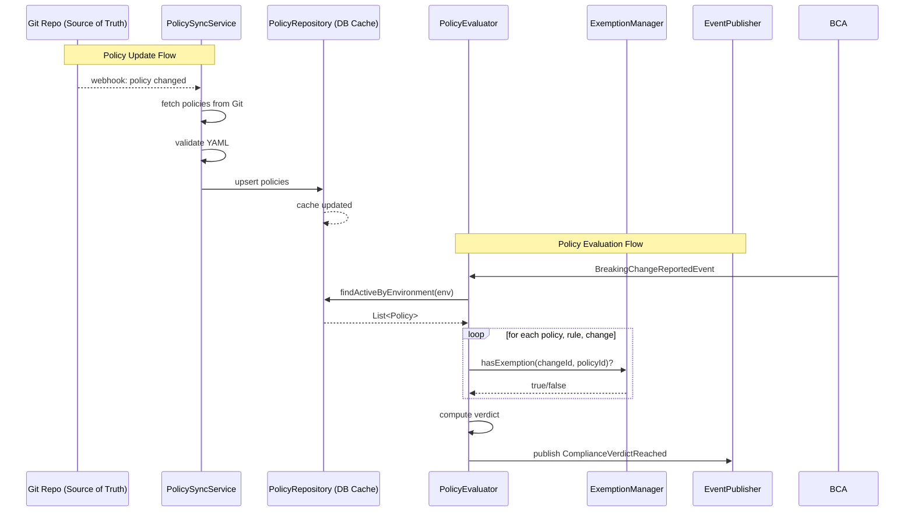

# Policy Engine Architecture

> **Module location:** `keystone-server` (this repository)
> **Language:** Java 21 + Spring Boot
> **Package:** `com.keystone.policy`
> **Guardian validators:** @PreAuthorize, package rings
> ⚠ Policy source of truth is the **Git repository**. The `policy` database schema is a **read-through cache** synced by `PolicySyncService`.

## Overview

Evaluates spec changes against defined governance policies. Manages the policy lifecycle (create/update/activate/deactivate/exempt). The `policy` database schema is a cache — all policy writes go through the Git repository. Produces compliance verdicts and publishes `ComplianceVerdictReached` events via Spring `ApplicationEventPublisher`.

## Responsibilities

- Manage Policy lifecycle (CRUD, activation, archival) — all mutations go through Git
- Evaluate `BreakingChangeReport` against active policies (read from DB cache)
- Support policy exemption workflow (time-bound, approved by compliance manager)
- Produce `ComplianceResult` with pass/fail/warn verdict
- Publish `ComplianceVerdictReached` and `ExemptionGranted` domain events
- Support hot-reload of policies without downtime (NFR-007) via `PolicySyncService`

## Components {#components}

| Component | Java Class | Purpose | Canonical Section |
|-----------|-----------|---------|-------------------|
| PolicyEvaluator | `PolicyEvaluator.java` | Evaluate BreakingChangeReport against policies | #policy-evaluator |
| PolicyRepository | `PolicyRepository.java` | JPA repository for Policy (cache) | #policy-repository |
| ExemptionManager | `ExemptionManager.java` | Exemption lifecycle (grant, renew, expire, revoke) | #exemption-manager |
| PolicyValidator | `PolicyValidator.java` | Validate policy DSL syntax and semantics | #policy-validator |
| PolicySyncService | `policy/sync/PolicySyncService.java` | Polls Git repo, syncs policies to DB cache | #policy-sync-service |
| GitPolicySource | `policy/source/GitPolicySource.java` | Implements PolicySource for Git | #git-policy-source |
| PolicyController | `policy/controller/PolicyController.java` | REST API for reading policies (writing goes through Git) | #policy-controller |

---

## Component Details {#component-details}

### PolicySyncService {#policy-sync-service}

**Purpose:** Periodically fetches policies from Git repository, validates them, and updates the database cache. Triggered by Git webhook or poll timer (60s fallback).

**Implementation File:** `src/main/java/com/keystone/policy/sync/PolicySyncService.java`

**Interface:**

```java
@Service
public class PolicySyncService {

    @Autowired private GitPolicySource gitPolicySource;
    @Autowired private PolicyValidator policyValidator;
    @Autowired private PolicyRepository policyRepository;
    @Autowired private ApplicationEventPublisher eventPublisher;

    @Scheduled(fixedRateString = "${policy.sync.interval.ms:60000}")
    @EventListener(condition = "#event.type == 'policy.webhook'")
    public void syncPolicies() {
        List<PolicySpec> remotePolicies = gitPolicySource.listPolicies();
        for (PolicySpec spec : remotePolicies) {
            ValidationResult result = policyValidator.validate(spec);
            if (result.isValid()) {
                Policy existing = policyRepository.findByNameAndEnvironment(
                    spec.getName(), spec.getEnvironment());
                if (existing == null || existing.getVersion() < spec.getVersion()) {
                    policyRepository.save(Policy.fromSpec(spec));
                }
            } else {
                log.warn("Invalid policy skipped: {} - {}", spec.getName(), result.getErrors());
            }
        }
        // Remove policies no longer in Git (soft delete)
        policyRepository.deactivateStalePolicies(remotePolicies.stream()
            .map(PolicySpec::getName).toList());
    }
}
```

### GitPolicySource {#git-policy-source}

**Purpose:** Fetches policy YAML files from a Git repository.

**Implementation File:** `src/main/java/com/keystone/policy/source/GitPolicySource.java`

**Interface:**

```java
@Component
public class GitPolicySource implements PolicySource {

    @Value("${policy.git.repository}")
    private String repoUrl;

    @Value("${policy.git.branch:main}")
    private String branch;

    @Override
    public List<PolicySpec> listPolicies() {
        // Clone/fetch repo, scan for keystone-policy*.yaml files
        // Parse YAML → PolicySpec records
    }

    @Override
    public PolicySpec getPolicy(String name) {
        // Fetch single policy by name from Git
    }
}

public interface PolicySource {
    List<PolicySpec> listPolicies();
    PolicySpec getPolicy(String name);
}
```

### PolicyEvaluator {#policy-evaluator}

**Purpose:** Evaluates a BreakingChangeReport against active policies.

**Implementation File:** `src/main/java/com/keystone/policy/evaluator/PolicyEvaluator.java`

**Interface:**

```java
@Service
public class PolicyEvaluator {

    @Autowired private PolicyRepository policyRepository;
    @Autowired private ExemptionManager exemptionManager;
    @Autowired private ApplicationEventPublisher eventPublisher;

    @EventListener
    public ComplianceResult onBreakingChangeReported(BreakingChangeReportedEvent event) {
        List<Policy> activePolicies = policyRepository.findActiveByEnvironment(
            event.getEnvironment());
        List<Violation> violations = new ArrayList<>();

        for (Policy policy : activePolicies) {
            for (PolicyRule rule : policy.getRules()) {
                for (Change change : event.getChanges()) {
                    if (evaluateCondition(rule.getCondition(), change)) {
                        if (rule.getAction() == Action.BLOCK
                            && exemptionManager.hasExemption(change.id(), policy.getId())) {
                            continue; // Exempted
                        }
                        violations.add(new Violation(policy.getId(), policy.getName(),
                            rule.getName(), rule.getAction(), rule.getMessage()));
                    }
                }
            }
        }

        Verdict verdict = violations.stream().anyMatch(v -> v.action() == Action.BLOCK)
            ? Verdict.FAIL
            : violations.isEmpty() ? Verdict.PASS : Verdict.WARN;

        ComplianceResult result = new ComplianceResult(event.getReportId(), verdict, violations);
        eventPublisher.publishEvent(new ComplianceVerdictReachedEvent(result));
        return result;
    }
}
```

### PolicyRepository {#policy-repository}

**Purpose:** JPA repository for the policy cache.

**Implementation File:** `src/main/java/com/keystone/policy/repository/PolicyRepository.java`

**Interface:**

```java
@Repository
public interface PolicyRepository extends JpaRepository<Policy, UUID> {
    List<Policy> findByEnvironmentAndState(String environment, PolicyState state);
    List<Policy> findActiveByEnvironment(String environment);
    Optional<Policy> findByNameAndEnvironment(String name, String environment);

    @Modifying
    @Query("UPDATE Policy p SET p.state = 'ARCHIVED' WHERE p.name NOT IN :activeNames")
    void deactivateStalePolicies(@Param("activeNames") List<String> activeNames);
}
```

### Policy DSL Format {#policy-dsl}

Policies are defined in YAML files stored in the Git repository:

```yaml
# keystone-policy-prod.yaml
apiVersion: keystone/v1
kind: Policy
metadata:
  name: no-breaking-changes-prod
  environment: prod
spec:
  rules:
    - name: block-breaking-changes
      condition: "change.severity == BREAKING && !policy.hasExemption(change)"
      action: block
      message: "Breaking changes require an exemption in production"
    - name: warn-deprecations
      condition: "change.severity == DEPRECATION"
      action: warn
      message: "Endpoint {{change.path}} is deprecated"
  targets:
    - "core-*"
    - "payment-*"
```

---

## Data Flow {#data-flow}



---

## Dependencies {#dependencies}

### Depends On
- **Breaking Change Analysis**: Subscribes to `BreakingChangeReported` events
- **Git Repository**: Source of truth for policies (external)

### Used By
- **Notification Engine**: Subscribes to `ComplianceVerdictReached` and `ExemptionGranted` events
- **Dashboard**: Reads compliance history via `PolicyRepository`

---

## Security Considerations {#security}

| Concern | Mitigation | Validator |
|---------|------------|-----------|
| Unauthorized policy changes | `@PreAuthorize("hasRole('COMPLIANCE_MANAGER')")` on policy write API | security-validator |
| Policy DSL injection | `PolicyValidator` rejects invalid conditions before sync | security-validator |
| Git repo access | SSH deploy key with read-only access to policy repo | security-validator |

---

## Testing Requirements {#testing}

| Test Type | Coverage Target | Approach |
|-----------|-----------------|----------|
| Unit | 85% | JUnit 5 + Mockito for evaluator, validator |
| Integration | 75% | @SpringBootTest with Testcontainers + embedded Git server |
| E2E | 60% | Full flow: Git push → sync → evaluate → verdict |

**Key Test Scenarios:**
- Policy sync: new policy in Git → appears in cache within 60s
- Policy sync: policy removed from Git → deactivated in cache
- Evaluation: matching BREAKING change with no exemption → verdict FAIL
- Evaluation: matching BREAKING change with active exemption → verdict WARN
- Evaluation: no matching rules → verdict PASS
- Policy hot-reload: policy updated in Git → next evaluation uses new rules

---

## Error Handling {#error-handling}

```java
public class PolicySyncException extends RuntimeException {
    public PolicySyncException(String message, Throwable cause) {
        super(message, cause);
    }
}

public class InvalidPolicyException extends RuntimeException {
    private final List<String> validationErrors;
    public InvalidPolicyException(String name, List<String> errors) {
        super("Invalid policy: " + name);
        this.validationErrors = errors;
    }
}
```

**Error Recovery:**
- PolicySyncException (Git unavailable): keep last synced cache; retry on next cycle
- InvalidPolicyException: skip invalid policy, log error, continue syncing others
- Evaluation failure: emit `ComplianceVerdictReached` with `Verdict.ERROR`; do not block pipeline

---

## Performance Considerations {#performance}

| Metric | Target | Monitoring |
|--------|--------|------------|
| Sync latency (Git → cache) | <10s from webhook | Micrometer `policy.sync.time` timer |
| Evaluation per BreakingChangeReport | <50ms p99 | Micrometer `policy.evaluation.time` timer |
| Cache staleness | <60s (poll fallback) | Micrometer `policy.sync.age` gauge |

---

*Last updated: 2026-06-12*
*Module version: v0.1.0*
*Canonical anchors: #components, #component-details, #policy-sync-service, #git-policy-source, #policy-evaluator, #policy-repository, #policy-dsl, #data-flow, #dependencies, #security, #testing, #error-handling, #performance*
