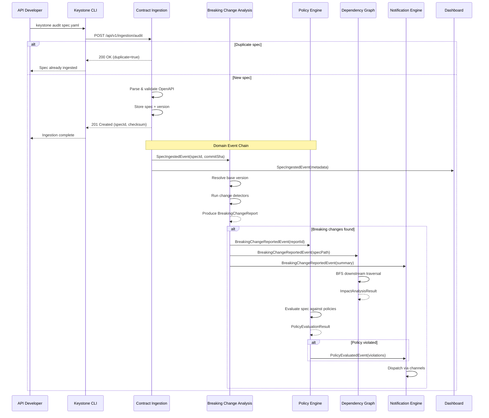
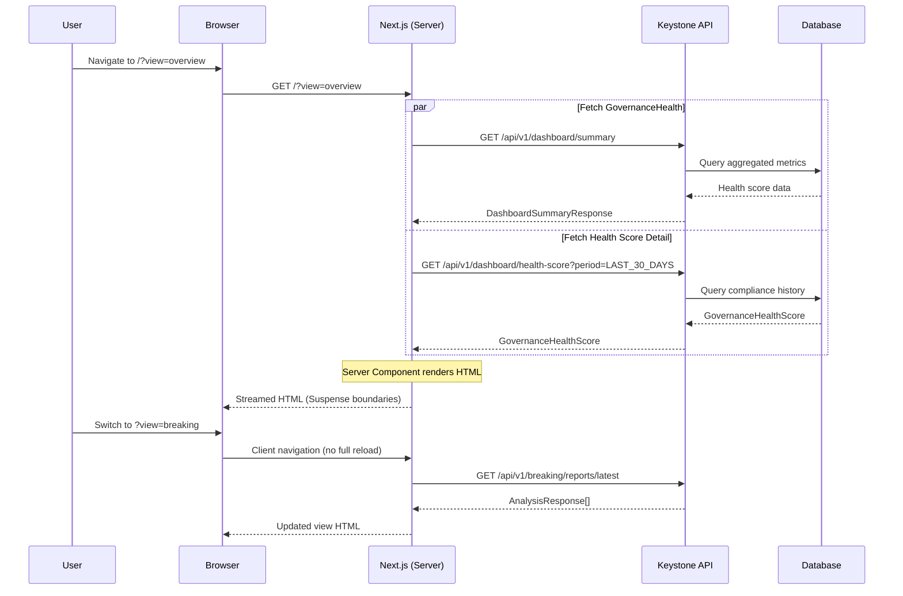
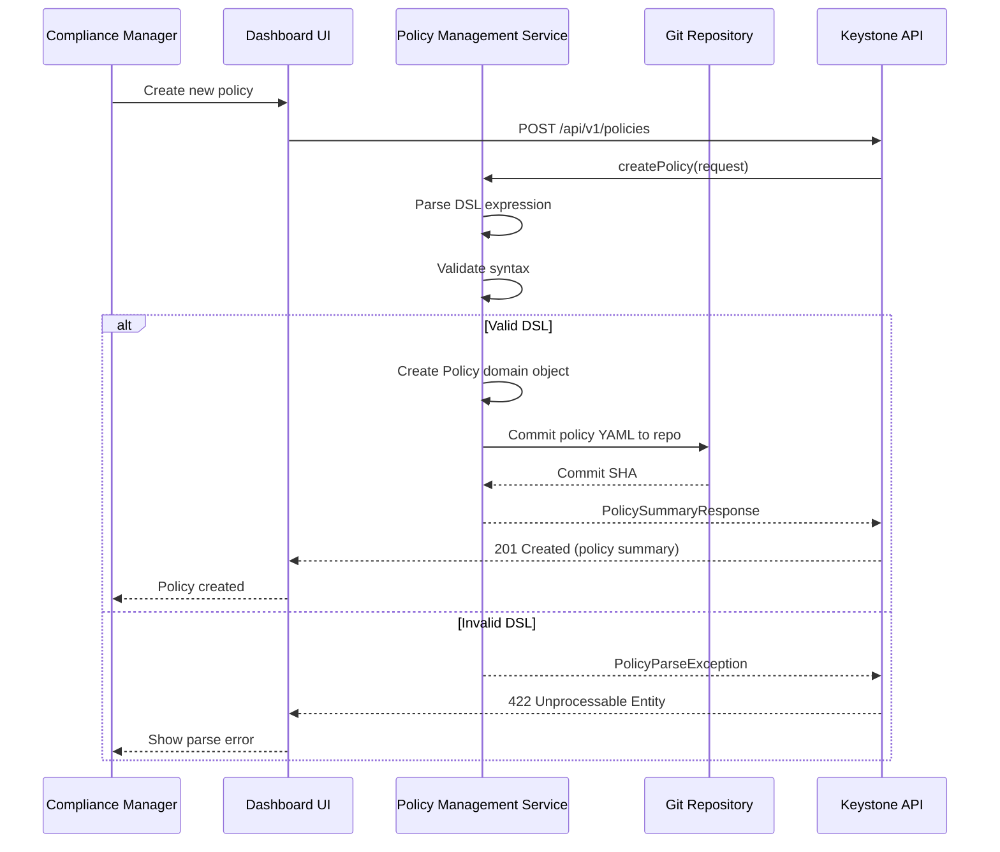
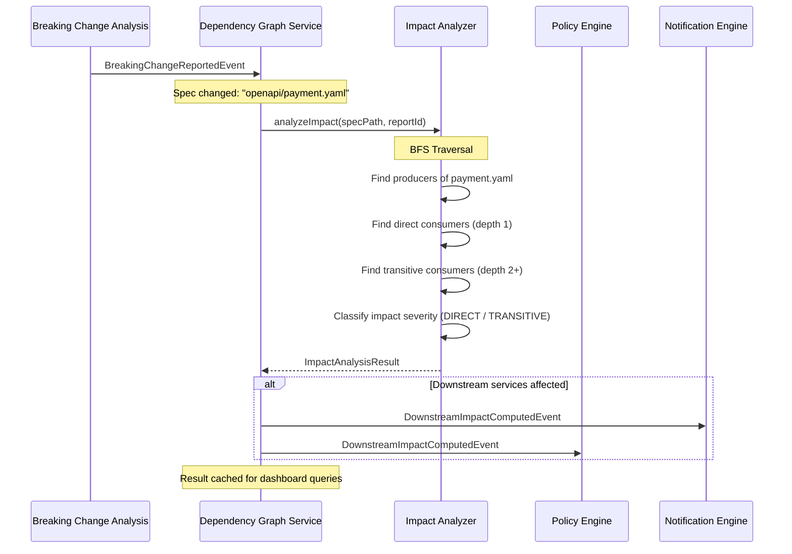
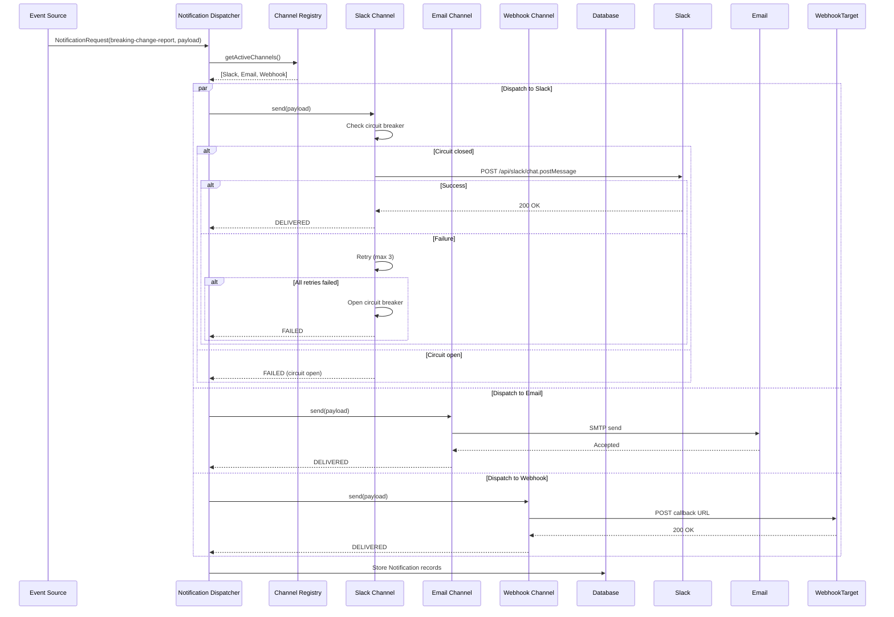

# Data Flow & Sequence Diagrams

## Overview

This document contains data flow diagrams and key sequence flows for the Keystone system. Each diagram illustrates how data moves between bounded contexts, actors, and external systems.

---

## 1. Spec Ingestion Flow

Flow when an API Developer submits a spec for audit, triggering the full governance pipeline.

---

## 2. Dashboard Data Fetching Flow

Flow when a user navigates to the dashboard and views data.

---

## 3. Policy Management Flow

Flow when a Compliance Manager creates or modifies a policy.

---

## 4. Dependency Graph & Impact Analysis Flow

Flow when a breaking change triggers impact analysis across the service dependency graph.

---

## 5. Notification Dispatch Flow

Flow when a governance event triggers multi-channel notification delivery.

---

## 6. Component Data Dependencies

Shows which backend endpoints each frontend view depends on.

```mermaid
flowchart TD
    subgraph FE["Frontend Views"]
        OV[Overview]
        INV[API Inventory]
        BR[Breaking Changes]
        POL[Policy Compliance]
        DG[Dependency Graph]
        NT[Notifications]
    end
    
    subgraph BE["Backend Endpoints"]
        S1["GET /dashboard/summary"]
        S2["GET /dashboard/health-score"]
        S3["GET /dashboard/health/{type}/{id}"]
        S4["GET /dashboard/compliance-history/{specId}"]
        S5["GET /dashboard/audit-log"]
        S6["GET /dashboard/violation-trends"]
        S7["GET /dashboard/policies"]
        S8["GET /dashboard/policies/breakdown"]
        S9["GET /dashboard/policies/{id}"]
        
        I1["GET /ingestion/apis"]
        I2["GET /ingestion/apis/stale"]
        
        B1["GET /breaking/reports/{id}"]
        B2["GET /breaking/repositories/{repo}/latest"]
        
        G1["GET /graph/services"]
        G2["POST /graph/impact"]
        
        N1["GET /notifications/channels"]
        N2["GET /notifications/{id}"]
    end
    
    OV --> S1
    OV --> S2
    OV --> S3
    
    INV --> I1
    INV --> I2
    
    BR --> B1
    BR --> B2
    
    POL --> S7
    POL --> S8
    POL --> S9
    POL --> S4
    
    DG --> G1
    DG --> G2
    
    NT --> N1
    NT --> N2
```

---

*Date: 2026-06-13*
