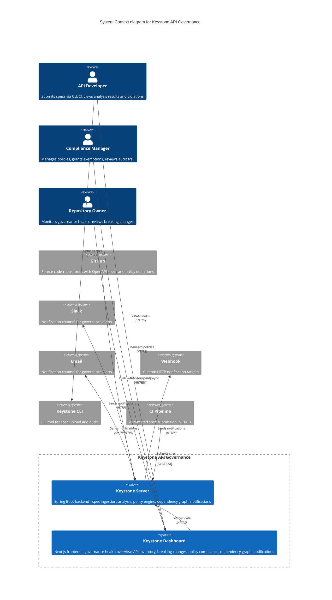
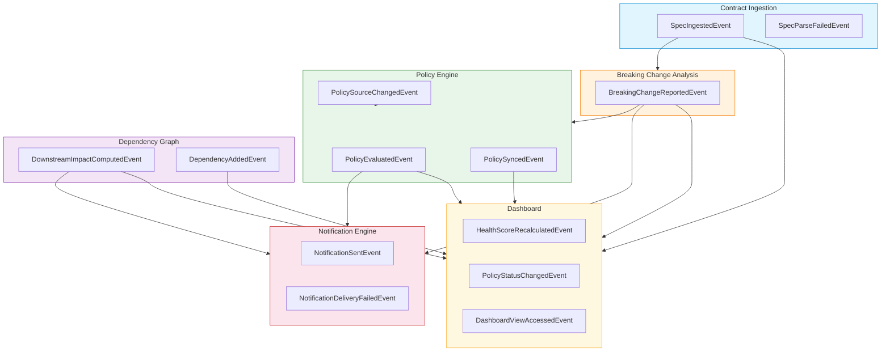
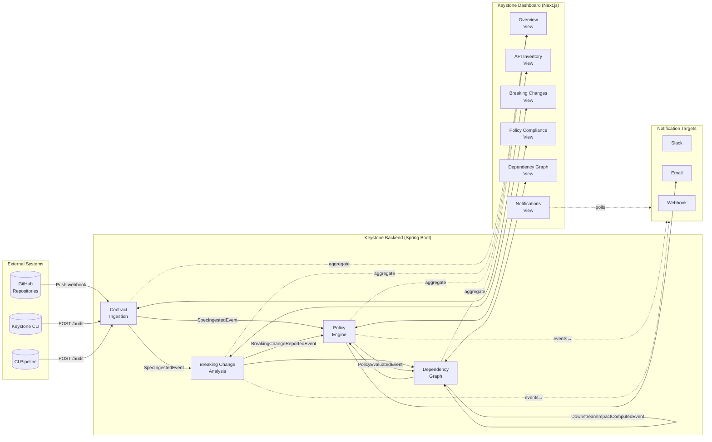
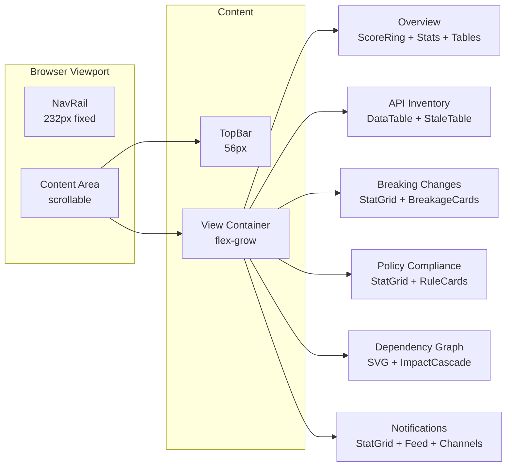

# System Context Diagram (C4 Level 1)

## Context

Keystone is an **OpenAPI Specification Governance Server**. The system ingests OpenAPI specs from repositories, detects breaking changes, evaluates policies, tracks service dependencies, and provides a governance dashboard.

This diagram shows the high-level system boundary and external actors.

---

## C4 System Context

---

## Event Flow Between Bounded Contexts

---

## System Context Data Flow

---

## Layout Structure

---

*Generated from session: 25c57121-7a91-47ce-ae20-5c561181984d*
*Date: 2026-06-13*
